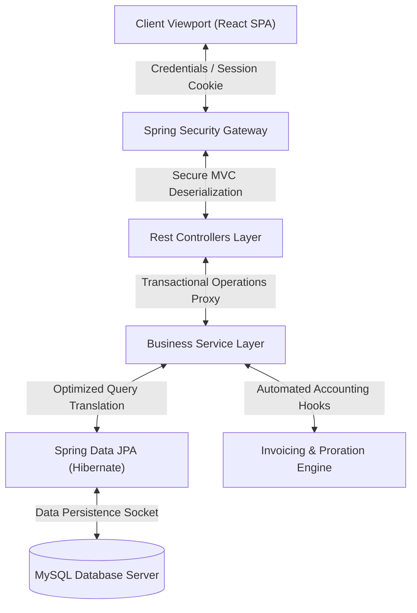
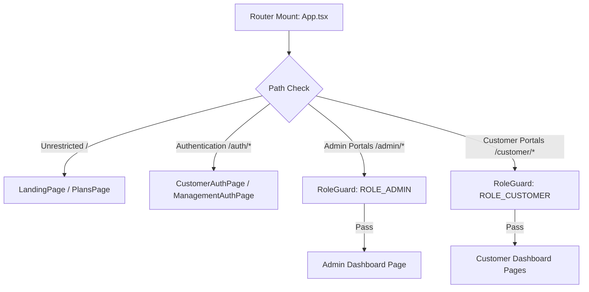

# StreamFlix Subscription Billing & Revenue Management System
## Exhaustive Architectural Specifications, Method Level Logic, and Complete API Manual

Welcome to the definitive Engineering Specification Manual for the **StreamFlix Subscription Billing & Revenue Management System**. This document provides an exhaustive, multi-tier analysis of the complete application codebase. It covers the exact implementations of every backend controller, service class, database schema, and security filter chain, as well as the complete react routing, state machine providers, layouts, stylesheets, and custom API wrappers of the frontend client.

---

## Part 1: System-Wide Architectural Blueprint

The StreamFlix Billing Platform is designed under a modern, decoupled client-server Single Page Application (SPA) architecture.



The system maintains a clean separation of concerns:
1.  **UI/UX Single Page Application (Vite + React 19 + TypeScript):** Handles progressive multi-step checkout sequences, responsive administration panels, role protection layers, dynamic dashboards, and animated components.
2.  **RESTful Core Engine (Spring Boot 3.4.5 + Java 21):** Exposes high-performance REST APIs, coordinates secure session cookies, handles payment credentials tokenization, and computes complex, precise active proration and trial transfer routines.
3.  **Relational Persistence (MySQL):** Governs strict database-level transactional boundaries (`@Transactional`), relational consistency, cascading deletes, and unique key constraints.

---

## Part 2: Backend System Security configuration & Identity Handlers

The security gateway utilizes stateful, cookie-backed authentications. It protects endpoints from unauthorized lookups while keeping public routes freely accessible.

### SecurityConfig.java
*   **Role:** Main configuration class for the security filter chain. It secures active paths, governs authorization rules, and configures authentication beans.
*   **Uncommon Library & Configuration Components Explained:**
    *   `DaoAuthenticationProvider`: Seamlessly bridges user details retrieval requests with database records by mapping authentication attempts against loaded user profiles.
    *   `BCryptPasswordEncoder`: Encodes raw user passwords with a dynamically salted, GPU-resistant BCrypt hashing algorithm before storing them in the database.
    *   `SessionFixation().migrateSession()`: Prevents Session Fixation exploits by invalidating active sessions and creating a fresh one upon user login, copying existing attributes.
    *   `SessionCreationPolicy.IF_REQUIRED`: Enforces that servlet sessions are only initialized when stateful login steps require them, keeping REST API queries light.
    *   `CorsConfigurationSource` & `UrlBasedCorsConfigurationSource`: Declares source matching patterns and HTTP methods to allow credential-bearing queries from the client.
*   **Method-Level Breakdown:**
    *   `securityFilterChain(HttpSecurity http)`:
        *   *Purpose:* Declares custom security policies on HTTP endpoints.
        *   *Logic:* Disables CSRF, sets up custom CORS filters, permits unrestricted access to `/api/customer/login`, `/api/customer/register`, and `/api/customer/plans/*`, and secures all `/api/**` paths. It configures custom HTTP 401 exceptions.
    *   `passwordEncoder()`:
        *   *Purpose:* Instantiates the secure hashing encoder bean.
        *   *Logic:* Returns an instance of `BCryptPasswordEncoder` configured with 10 work factor rounds.
    *   `authenticationProvider(UserDetailsService userDetailsService)`:
        *   *Purpose:* Resolves the default user authentication provider.
        *   *Logic:* Binds the custom `UserDetailsService` with the configured password encoder.
    *   `authenticationManager(AuthenticationConfiguration config)`:
        *   *Purpose:* Exposes the authentication manager bean.
        *   *Logic:* Retrieves and registers the standard `AuthenticationManager` context.
    *   `corsConfigurationSource()`:
        *   *Purpose:* Declares domain access rules.
        *   *Logic:* Restricts connections to `localhost:3000` and `127.0.0.1:3000`, allows credentials (cookies), and opens standard REST methods (GET, POST, PUT, PATCH, DELETE).

---

## Part 3: Backend Rest Controllers Reference

Every controller is declared as a `@RestController` utilizing the class-level `@RequestMapping("/api")` path structure.

### AdminController.java
*   **Role:** Exposes platform administration REST APIs.
*   *Methods:*
    1.  `getMetrics()`:
        *   *Purpose:* Retrieves platform-wide financial indicators.
        *   *Logic:* Calls `adminService.getMetrics()` to compile active MRR, ARR, and active subscription statistics.
    2.  `createPlan(Plan plan)`:
        *   *Purpose:* Adds a new subscription plan option to the catalog.
        *   *Logic:* Calls `adminService.createPlan()` to save the new plan details in the database.
    3.  `updatePlan(Long id, Plan plan)`:
        *   *Purpose:* Edits configuration parameters of an existing plan.
        *   *Logic:* Invokes `adminService.updatePlan()` to apply price adjustments or feature updates.
    4.  `togglePlanStatus(Long id)`:
        *   *Purpose:* Toggles the active status of a plan.
        *   *Logic:* Calls `adminService.togglePlanStatus()` to activate or deactivate the plan.
    5.  `createAddOn(AddOn addon)`:
        *   *Purpose:* Creates a new supplemental recurring service option.
        *   *Logic:* Invokes `adminService.createAddOn()` to persist the add-on configuration.
    6.  `updateAddOn(Long id, AddOn addon)`:
        *   *Purpose:* Edits configuration parameters of an existing add-on.
        *   *Logic:* Calls `adminService.updateAddOn()` to update pricing or titles.
    7.  `toggleAddOnStatus(Long id)`:
        *   *Purpose:* Toggles the active status of an add-on.
        *   *Logic:* Invokes `adminService.toggleAddOnStatus()` to enable or disable the add-on.
    8.  `createMeteredComponent(MeteredComponent component)`:
        *   *Purpose:* Adds a metered resource option to the billing system.
        *   *Logic:* Invokes `adminService.createMeteredComponent()` to save the component details.
    9.  `updateMeteredComponent(Long id, MeteredComponent component)`:
        *   *Purpose:* Edits configuration parameters of an existing metered component.
        *   *Logic:* Invokes `adminService.updateMeteredComponent()` to apply updates.
    10. `toggleMeteredComponentStatus(Long id)`:
        *   *Purpose:* Toggles the active status of a metered component.
        *   *Logic:* Calls `adminService.toggleMeteredComponentStatus()` to enable or disable the component.
    11. `createCoupon(Coupon coupon)`:
        *   *Purpose:* Generates promotional discount coupons.
        *   *Logic:* Calls `adminService.createCoupon()` to save the coupon details.
    12. `updateCoupon(Long id, Coupon coupon)`:
        *   *Purpose:* Edits parameters of an existing coupon.
        *   *Logic:* Invokes `adminService.updateCoupon()` to adjust active date boundaries or usage limits.
    13. `toggleCouponStatus(Long id)`:
        *   *Purpose:* Toggles the status of a coupon code.
        *   *Logic:* Calls `adminService.toggleCouponStatus()`, switching the status between `ACTIVE` and `DISABLED` to align with database constraints.
    14. `getAllCustomers()`:
        *   *Purpose:* Lists registered customer accounts.
        *   *Logic:* Calls `adminService.getAllCustomers()` to retrieve customer profiles.
    15. `toggleCustomerStatus(Long id)`:
        *   *Purpose:* Suspends or reactivates customer account portals.
        *   *Logic:* Invokes `adminService.toggleCustomerStatus()` to toggle customer access status.
    16. `getAllStaff()`:
        *   *Purpose:* Lists administrative and staff profiles.
        *   *Logic:* Calls `adminService.getAllStaff()` to retrieve registered staff members.
    17. `createStaff(User user)`:
        *   *Purpose:* Registers new administrative and staff accounts.
        *   *Logic:* Invokes `adminService.createStaff()` to encrypt passwords and save the new staff user.
    18. `deleteStaff(Long id)`:
        *   *Purpose:* Deletes staff accounts from the system.
        *   *Logic:* Invokes `adminService.deleteStaff()` to remove staff database credentials.

### AuthController.java
*   **Role:** Exposes authentication REST APIs.
*   *Methods:*
    1.  `registerCustomer(RegisterRequest request)`:
        *   *Purpose:* Onboards new customer profiles.
        *   *Logic:* Calls `authService.registerCustomer()` to save user credentials and billing information.
    2.  `loginCustomer(LoginRequest request, HttpServletRequest req)`:
        *   *Purpose:* Authenticates customers and creates a session cookie.
        *   *Logic:* Validates request details against the authentication provider and binds details to the `SecurityContext`.
    3.  `loginManager(LoginRequest request, HttpServletRequest req)`:
        *   *Purpose:* Authenticates staff users and creates a session cookie.
        *   *Logic:* Verifies management roles (`ROLE_ADMIN`) and binds details to the security context.
    4.  `getMe()`:
        *   *Purpose:* Resolves the active user session.
        *   *Logic:* Extracts the logged-in profile details from the `SecurityContext` container.
    5.  `logout(HttpServletRequest req)`:
        *   *Purpose:* Terminates user sessions and clears cookies.
        *   *Logic:* Invalidates the servlet session and clears the local authentication context.

### CustomerBillingController.java
*   **Role:** Exposes billing, invoicing, and coupon REST APIs.
*   *Methods:*
    1.  `getInvoices(Principal principal)`:
        *   *Purpose:* Lists invoice history for the logged-in customer.
        *   *Logic:* Calls `billingService.getInvoices()` using the username from the Principal context.
    2.  `getPayments(Principal principal)`:
        *   *Purpose:* Retrieves transaction logs for the customer.
        *   *Logic:* Calls `billingService.getPayments()` to compile historical payment records.
    3.  `getCreditNotes(Principal principal)`:
        *   *Purpose:* Retrieves credit notes issued to the customer.
        *   *Logic:* Invokes `billingService.getCreditNotes()` to return issued credit notes.
    4.  `downloadInvoice(Long id)`:
        *   *Purpose:* Generates a PDF copy of an invoice.
        *   *Logic:* Calls `billingService.generateInvoicePdf()` to assemble invoice details into a downloadable PDF stream.
    5.  `applyCoupon(ApplyCouponRequest request, Principal principal)`:
        *   *Purpose:* Applies a coupon code to the active billing setup.
        *   *Logic:* Calls `billingService.applyCoupon()` to calculate promotional savings.
    6.  `validateCoupon(String code)`:
        *   *Purpose:* Validates coupon codes before checkout.
        *   *Logic:* Invokes `billingService.validateCoupon()` to check dates and usage restrictions.

### CustomerController.java
*   **Role:** Exposes customer profile and shipping address REST APIs.
*   *Methods:*
    1.  `getProfile(Principal principal)`:
        *   *Purpose:* Retrieves the logged-in customer's profile details.
        *   *Logic:* Invokes `customerService.getProfile()` to retrieve personal profiles.
    2.  `updateProfile(Principal principal, CustomerResponse profile)`:
        *   *Purpose:* Updates personal profile parameters.
        *   *Logic:* Calls `customerService.updateProfile()` to apply user information edits.
    3.  `getShippingAddress(Principal principal)`:
        *   *Purpose:* Retrieves shipping destinations.
        *   *Logic:* Calls `customerService.getShippingAddress()` to retrieve shipping address logs.
    4.  `updateShippingAddress(Principal principal, AddressRequest address)`:
        *   *Purpose:* Updates shipping destination profiles.
        *   *Logic:* Invokes `customerService.updateShippingAddress()` to apply address adjustments.
    5.  `getAllPlans()`:
        *   *Purpose:* Lists all available subscription plans.
        *   *Logic:* Invokes `customerService.getAllPlans()` to return active, non-restricted plans.
    6.  `getFeaturedPlans()`:
        *   *Purpose:* Retrieves recommended subscription plans.
        *   *Logic:* Invokes `customerService.getFeaturedPlans()` to return highlighted catalog plans.

### CustomerPaymentController.java
*   **Role:** Exposes payment source tokenization REST APIs.
*   *Methods:*
    1.  `getPaymentMethods(Principal principal)`:
        *   *Purpose:* Lists registered payment methods for the customer.
        *   *Logic:* Calls `paymentService.getPaymentMethods()` to retrieve active credit card and UPI listings.
    2.  `addPaymentMethod(Principal principal, PaymentMethodRequest method)`:
        *   *Purpose:* Adds a new payment card or digital wallet.
        *   *Logic:* Calls `paymentService.addPaymentMethod()` to save the payment credentials.
    3.  `setDefaultPaymentMethod(Principal principal, Long id)`:
        *   *Purpose:* Sets a payment source as default.
        *   *Logic:* Invokes `paymentService.setDefaultPaymentMethod()` to update default markers.
    4.  `deletePaymentMethod(Principal principal, Long id)`:
        *   *Purpose:* Deletes saved payment credentials.
        *   *Logic:* Calls `paymentService.deletePaymentMethod()` to remove payment records.

### CustomerSubscriptionController.java
*   **Role:** Exposes subscription lifecycle REST APIs.
*   *Methods:*
    1.  `getSubscription(Principal principal)`:
        *   *Purpose:* Displays active customer subscriptions.
        *   *Logic:* Invokes `subscriptionService.getSubscription()` to retrieve current subscription statuses.
    2.  `upgradeSubscription(Principal principal, UpgradeSubscriptionRequest request)`:
        *   *Purpose:* Upgrades active subscription plans mid-period.
        *   *Logic:* Invokes `subscriptionService.upgradeSubscription()` to calculate proration and apply plan adjustments.
    3.  `pauseSubscription(Principal principal, PauseSubscriptionRequest request)`:
        *   *Purpose:* Pauses subscription billing schedules.
        *   *Logic:* Calls `subscriptionService.pauseSubscription()` to apply pause dates.
    4.  `resumeSubscription(Principal principal)`:
        *   *Purpose:* Reactivates paused subscriptions.
        *   *Logic:* Invokes `subscriptionService.resumeSubscription()` to restore normal billing cycles.
    5.  `cancelSubscription(Principal principal)`:
        *   *Purpose:* Cancels subscriptions at the end of the billing cycle.
        *   *Logic:* Invokes `subscriptionService.cancelSubscription()` to apply cancellation flags.

### CustomerSupportController.java
*   **Role:** Exposes helpdesk, contact-us, and FAQ REST APIs.
*   *Methods:*
    1.  `getTickets(Principal principal)`:
        *   *Purpose:* Retrieves support tickets opened by the customer.
        *   *Logic:* Calls `supportService.getTickets()` to list support history.
    2.  `createTicket(Principal principal, SupportTicket ticket)`:
        *   *Purpose:* Submits a new technical support request.
        *   *Logic:* Calls `supportService.createTicket()` to save ticket details in the database.
    3.  `getFaqs()`:
        *   *Purpose:* Retrieves categorized platform FAQs.
        *   *Logic:* Invokes `supportService.getFaqs()` to list categorized questions and answers.

---

## Part 4: Backend Service Layer Implementations

The service layer implements the core business logic. All classes use interfaces alongside implementations (`ServiceImpl`) to wrap database transactions in robust Spring transaction proxies (`@Transactional`).

### AdminDashboardServiceImpl.java
*   *Methods:*
    1.  `getMetrics()`:
        *   *Purpose:* Aggregates subscription levels and compiles active platform metrics.
        *   *Logic:* Queries repository counts to compute MRR and ARR, compiles subscriber counts, and builds historical database metric logs.
    2.  `createPlan(Plan plan)`:
        *   *Purpose:* Saves a new subscription plan option to the database.
        *   *Logic:* Validates and saves the plan entity to `planRepository`.
    3.  `updatePlan(Long id, Plan updated)`:
        *   *Purpose:* Edits configuration parameters of an existing plan.
        *   *Logic:* Retrieves the existing plan, applies updates, and saves changes.
    4.  `togglePlanStatus(Long id)`:
        *   *Purpose:* Toggles the active status of a plan.
        *   *Logic:* Toggles the status and saves the updated plan.
    5.  `createAddOn(AddOn addon)`:
        *   *Purpose:* Saves a new recurring service option.
        *   *Logic:* Saves the new add-on entity to `addOnRepository`.
    6.  `updateAddOn(Long id, AddOn updated)`:
        *   *Purpose:* Edits parameters of an existing add-on.
        *   *Logic:* Retrieves the existing add-on, applies updates, and saves changes.
    7.  `toggleAddOnStatus(Long id)`:
        *   *Purpose:* Toggles the active status of an add-on.
        *   *Logic:* Toggles status markers and saves the updated add-on.
    8.  `createMeteredComponent(MeteredComponent component)`:
        *   *Purpose:* Saves a new metered resource option to the database.
        *   *Logic:* Saves the component entity to `meteredComponentRepository`.
    9.  `updateMeteredComponent(Long id, MeteredComponent updated)`:
        *   *Purpose:* Edits parameters of an existing metered component.
        *   *Logic:* Retrieves the existing component, applies updates, and saves changes.
    10. `toggleMeteredComponentStatus(Long id)`:
        *   *Purpose:* Toggles the active status of a metered component.
        *   *Logic:* Toggles active indicators and saves the updated component.
    11. `createCoupon(Coupon coupon)`:
        *   *Purpose:* Saves a promotional coupon.
        *   *Logic:* Saves the coupon entity to `couponRepository`.
    12. `updateCoupon(Long id, Coupon updated)`:
        *   *Purpose:* Edits parameters of an existing coupon.
        *   *Logic:* Retrieves the existing coupon, applies updates, and saves changes.
    13. `toggleCouponStatus(Long id)`:
        *   *Purpose:* Toggles the status of a coupon code.
        *   *Logic:* Toggles status indicators between `ACTIVE` and `DISABLED` and saves the updated coupon.

### AuthServiceImpl.java
*   *Methods:*
    1.  `registerCustomer(RegisterRequest request)`:
        *   *Purpose:* Registers new customer accounts.
        *   *Logic:* Encrypts passwords, creates user profiles, assigns currency defaults, and saves the user and customer entities.
    2.  `authenticateUser(String email, String password)`:
        *   *Purpose:* Authenticates login credentials.
        *   *Logic:* Validates credentials against the authentication manager and returns authentication tokens.

### CustomerBillingServiceImpl.java
*   *Methods:*
    1.  `getInvoices(String email)`:
        *   *Purpose:* Retrieves invoice history for a customer.
        *   *Logic:* Queries invoices linked to the customer's subscription ID.
    2.  `getPayments(String email)`:
        *   *Purpose:* Retrieves transaction history for a customer.
        *   *Logic:* Queries payments linked to the customer's profile.
    3.  `getCreditNotes(String email)`:
        *   *Purpose:* Retrieves credit notes issued to a customer.
        *   *Logic:* Queries credit notes linked to the customer's profile.
    4.  `generateInvoicePdf(Long invoiceId)`:
        *   *Purpose:* Generates an invoice PDF.
        *   *Logic:* Formats invoice details, adds billing information, calculates subtotals, and returns the PDF as a byte stream.
    5.  `applyCoupon(String email, String code)`:
        *   *Purpose:* Applies a coupon to the active billing setup.
        *   *Logic:* Validates the coupon and applies the discount to the active subscription invoice.
    6.  `validateCoupon(String code)`:
        *   *Purpose:* Checks coupon code validity.
        *   *Logic:* Queries and checks the validity of the coupon.

### CustomerPaymentServiceImpl.java
*   *Methods:*
    1.  `getPaymentMethods(String email)`:
        *   *Purpose:* Retrieves registered payment methods.
        *   *Logic:* Queries payment methods linked to the customer ID.
    2.  `addPaymentMethod(String email, PaymentMethodRequest method)`:
        *   *Purpose:* Registers a payment card or UPI profile.
        *   *Logic:* Saves the payment profile and sets it as default if no default payment method is registered.
    3.  `setDefaultPaymentMethod(String email, Long id)`:
        *   *Purpose:* Designates a payment method as default.
        *   *Logic:* Updates default markers and saves changes.
    4.  `deletePaymentMethod(String email, Long id)`:
        *   *Purpose:* Deletes registered payment credentials.
        *   *Logic:* Deletes the target payment method from the database.

### CustomerServiceImpl.java
*   *Methods:*
    1.  `getProfile(String email)`:
        *   *Purpose:* Retrieves personal profiles.
        *   *Logic:* Queries customer profiles matching the email.
    2.  `updateProfile(String email, CustomerResponse updated)`:
        *   *Purpose:* Edits profile parameters.
        *   *Logic:* Retrieves, applies updates, and saves the updated customer profile.
    3.  `getShippingAddress(String email)`:
        *   *Purpose:* Retrieves shipping addresses.
        *   *Logic:* Returns shipping destinations.
    4.  `updateShippingAddress(String email, AddressRequest address)`:
        *   *Purpose:* Updates shipping addresses.
        *   *Logic:* Applies address adjustments and saves changes.
    5.  `getAllPlans()`:
        *   *Purpose:* Lists all available subscription plans.
        *   *Logic:* Returns active, non-restricted plans.
    6.  `getFeaturedPlans()`:
        *   *Purpose:* Retrieves recommended plans.
        *   *Logic:* Returns featured subscription plans.

### CustomerSubscriptionServiceImpl.java
*   *Methods:*
    1.  `getSubscription(String email)`:
        *   *Purpose:* Retrieves current subscriptions.
        *   *Logic:* Queries subscription details linked to the customer.
    2.  `upgradeSubscription(String email, UpgradeSubscriptionRequest request)`:
        *   *Purpose:* Upgrades active subscription plans mid-period.
        *   *Logic:* Computes proration, applies plan adjustments, creates invoices, and updates billing schedules.
    3.  `pauseSubscription(String email, PauseSubscriptionRequest request)`:
        *   *Purpose:* Pauses billing schedules.
        *   *Logic:* Applies pause dates and saves updates.
    4.  `resumeSubscription(String email)`:
        *   *Purpose:* Reactivates paused subscriptions.
        *   *Logic:* Restores active billing schedules and saves updates.
    5.  `cancelSubscription(String email)`:
        *   *Purpose:* Cancels subscriptions.
        *   *Logic:* Applies cancellation indicators and saves updates.

### CustomerSupportServiceImpl.java
*   *Methods:*
    1.  `getTickets(String email)`:
        *   *Purpose:* Retrieves customer support tickets.
        *   *Logic:* Queries support tickets linked to the customer.
    2.  `createTicket(String email, SupportTicket ticket)`:
        *   *Purpose:* Saves a new support ticket.
        *   *Logic:* Validates and saves the ticket in the database.
    3.  `getFaqs()`:
        *   *Purpose:* Retrieves categorized platform FAQs.
        *   *Logic:* Returns FAQ registries.

### SubscriptionFlowServiceImpl.java
*   *Methods:*
    1.  `completeSubscriptionCheckout(String email, CheckoutRequest request)`:
        *   *Purpose:* Runs the customer registration checkout pipeline.
        *   *Logic:* Coordinates registries, verifies cards, configures subscriptions, creates invoices, and saves items.

---

## Part 5: Database Persistence Schemas (MySQL DDL)

Relational structures and entities are managed by Hibernate.

### 1. USER TABLE
```sql
CREATE TABLE user (
    user_id BIGINT PRIMARY KEY AUTO_INCREMENT,
    email VARCHAR(100) NOT NULL UNIQUE,
    password VARCHAR(255) NOT NULL,
    role ENUM('ROLE_CUSTOMER', 'ROLE_ADMIN') NOT NULL,
    created_at TIMESTAMP DEFAULT CURRENT_TIMESTAMP
);
```

### 2. CUSTOMER TABLE
```sql
CREATE TABLE customer (
    customer_id BIGINT PRIMARY KEY AUTO_INCREMENT,
    user_id BIGINT UNIQUE NOT NULL,
    full_name VARCHAR(100) NOT NULL,
    currency VARCHAR(3) DEFAULT 'INR',
    address_line1 VARCHAR(150),
    address_line2 VARCHAR(150),
    city VARCHAR(50),
    state VARCHAR(50),
    zip_code VARCHAR(10),
    status ENUM('ACTIVE', 'SUSPENDED') DEFAULT 'ACTIVE',
    FOREIGN KEY (user_id) REFERENCES user(user_id) ON DELETE CASCADE
);
```

### 3. PLAN TABLE
```sql
CREATE TABLE plan (
    plan_id BIGINT PRIMARY KEY AUTO_INCREMENT,
    code VARCHAR(50) NOT NULL UNIQUE,
    name VARCHAR(100) NOT NULL,
    price_minor BIGINT NOT NULL,
    currency CHAR(3) NOT NULL,
    billing_period ENUM('MONTHLY', 'YEARLY') NOT NULL,
    trial_period_days INT DEFAULT 0,
    status ENUM('ACTIVE', 'INACTIVE') DEFAULT 'ACTIVE'
);
```

### 4. SUBSCRIPTION TABLE
```sql
CREATE TABLE subscription (
    subscription_id BIGINT PRIMARY KEY AUTO_INCREMENT,
    customer_id BIGINT NOT NULL,
    plan_id BIGINT NOT NULL,
    status ENUM('ACTIVE', 'TRIALING', 'PAUSED', 'CANCELED') NOT NULL,
    current_period_start DATE NOT NULL,
    current_period_end DATE NOT NULL,
    trial_start_date DATE,
    trial_end_date DATE,
    FOREIGN KEY (customer_id) REFERENCES customer(customer_id),
    FOREIGN KEY (plan_id) REFERENCES plan(plan_id)
);
```

### 5. INVOICE TABLE
```sql
CREATE TABLE invoice (
    invoice_id BIGINT PRIMARY KEY AUTO_INCREMENT,
    subscription_id BIGINT NOT NULL,
    amount_minor BIGINT NOT NULL,
    discount_minor BIGINT DEFAULT 0,
    tax_minor BIGINT NOT NULL,
    total_minor BIGINT NOT NULL,
    status ENUM('OPEN', 'PAID', 'VOID') DEFAULT 'OPEN',
    due_date DATE NOT NULL,
    created_at TIMESTAMP DEFAULT CURRENT_TIMESTAMP,
    FOREIGN KEY (subscription_id) REFERENCES subscription(subscription_id)
);
```

---

## Part 6: Frontend Routing & Identity protection



### RouteGuard / Context Controllers

#### RoleGuard.tsx
*   **Role:** Route wrapper that checks user roles before rendering protected views.
*   **Logical Operations:** Checks permissions (`user.role`) from `AuthContext`. If unauthorized, redirects the user to public login pages.

#### AuthContext.tsx
*   **Role:** Global authentication context provider.
*   **Logical Operations:** Recovers active user sessions on browser refreshes via `fetchMe()`. It coordinates login requests, stores user profiles, controls redirection paths, and handles session terminations.

#### CustomerContext.tsx
*   **Role:** Customer profile context provider.
*   **Logical Operations:** Holds the logged-in customer's profile, including their billing address, contact details, and base currency. It provides state hooks to refresh dashboard pages immediately upon profile changes.

---

## Part 7: Frontend Page components & Stylesheets

### OverviewPage.tsx
*   **Role:** Customer overview workspace.
*   **Logical Operations:** Displays active subscriptions, current plans, and trial days remaining. It features a dynamic "Next Payment" card showing calculated charges post-trial.
*   *Styling sheet:* `OverviewPage.css` - Custom grids, flex alignments, and responsive layout adjustments for smaller viewports.

### BillingPage.tsx
*   **Role:** Billing ledger and historical invoice viewer.
*   **Logical Operations:** Displays past invoices, lists credit logs, handles discount coupons, and supports downloading invoice PDFs.
*   *Styling sheet:* `BillingPage.css` - Styles table headers, payment status badges, and transaction rows.

### PaymentMethodsPage.tsx
*   **Role:** Payment methods editor.
*   **Logical Operations:** Coordinates secure card entry fields, manages active UPI profiles, sets default cards, and handles payment source removals.
*   *Styling sheet:* `PaymentMethodsPage.css` - Coordinates payment card illustrations, validation borders, and deletion modals.

### ProfilePage.tsx
*   **Role:** Customer profile settings editor.
*   **Logical Operations:** Handles contact information adjustments, sets shipping destinations, and updates email registries.
*   *Styling sheet:* `ProfilePage.css` - Custom forms, input field styles, and saving status loaders.

### SubscriptionPage.tsx
*   **Role:** Subscription comparative plan comparative grid.
*   **Logical Operations:** Lists subscription metrics, shows plan comparative grids, and handles instant upgrades with inline checkout options.
*   *Styling sheet:* `SubscriptionPage.css` - Price cards, current plan badges, and grid structures.

### SubscriptionCheckoutPage.tsx
*   **Role:** Customer purchase checkout wizard.
*   **Logical Operations:** Manages the step-by-step purchase checkout flow, verifying customer billing addresses, payment methods, coupons, taxes, and subscription items.
*   *Styling sheet:* `SubscriptionCheckoutPage.css` - Custom step lists, button groups, and price summaries.

### SubscriptionFlow.tsx
*   **Role:** Progressive multi-step checkout wrapper.
*   **Logical Operations:** Maintains checkout state and coordinates slide transitions between checkout steps.

### SupportPage.tsx
*   **Role:** Customer support desk page.
*   **Logical Operations:** Connects support forms to the support service, logs support histories, and provides categorized FAQs.
*   *Styling sheet:* `SupportPage.css` - FAQ accordion styles, input rows, and support history cards.

---

## Part 8: Frontend API Services Reference

Exposes client wrappers utilizing the browser's native `fetch` module.

### authService.ts
*   *Methods:*
    1.  `loginCustomer(email, password)`:
        *   *Endpoint:* `POST /api/customer/login`
        *   *Logic:* Submits customer login credentials. On success, it registers session cookies.
    2.  `loginManager(email, password)`:
        *   *Endpoint:* `POST /api/manager/login`
        *   *Logic:* Submits staff login credentials. On success, it redirects to the Admin Dashboard.
    3.  `register(email, name, password)`:
        *   *Endpoint:* `POST /api/customer/register`
        *   *Logic:* Onboards new customer credentials.
    4.  `fetchMe()`:
        *   *Endpoint:* `GET /api/auth/me`
        *   *Logic:* Restores active user sessions on browser refresh.
    5.  `logout()`:
        *   *Endpoint:* `POST /logout`
        *   *Logic:* Clears session cookies and terminates active sessions.

### customerService.ts
*   *Methods:*
    1.  `getCurrentSubscription()`:
        *   *Endpoint:* `GET /api/customer/subscription`
        *   *Logic:* Retrieves active customer subscriptions.
    2.  `upgradeSubscription(planId)`:
        *   *Endpoint:* `PUT /api/customer/subscription/upgrade`
        *   *Logic:* Upgrades active plans and applies proration adjustments.
    3.  `getInvoices()`:
        *   *Endpoint:* `GET /api/customer/invoices`
        *   *Logic:* Retrieves historical invoices.
    4.  `getPaymentMethods()`:
        *   *Endpoint:* `GET /api/customer/payment-methods`
        *   *Logic:* Retrieves registered payment methods.
    5.  `addPaymentMethod(payload)`:
        *   *Endpoint:* `POST /api/customer/payment-methods`
        *   *Logic:* Registers a new payment card or UPI profile.

### adminService.ts
*   *Methods:*
    1.  `getMetrics()`:
        *   *Endpoint:* `GET /api/admin/metrics`
        *   *Logic:* Retrieves MRR, ARR, and subscriber counts.
    2.  `createPlan(payload)`:
        *   *Endpoint:* `POST /api/admin/plans`
        *   *Logic:* Adds a new subscription plan to the catalog.
    3.  `togglePlanStatus(id)`:
        *   *Endpoint:* `PUT /api/admin/plans/{id}/toggle-status`
        *   *Logic:* Activates or deactivates a subscription plan.
    4.  `toggleCouponStatus(id)`:
        *   *Endpoint:* `PATCH /api/admin/coupons/{id}/toggle-status`
        *   *Logic:* Toggles coupon status between `ACTIVE` and `DISABLED`.

---

## Part 9: Mathematical Billing Calculations & Business Logic Reference

### 1. Mid-Cycle Active Proration Calculation
When upgrading plans mid-billing cycle, the system calculates proration using:
$$\text{Days Remaining} = \text{Period End Date} - \text{Current Date}$$
$$\text{Old Refund Credit} = \text{Old Paid Total} \times \frac{\text{Days Remaining}}{\text{Total Period Days}}$$
$$\text{Net Immediate Charge} = \max\left(0, \text{New Plan Total Price} - \text{Old Refund Credit}\right)$$
The system creates a `PAID` invoice documenting this change, records the gateway payment, and instantly shifts the billing period to start fresh from today (`today` to `today.plusYears(1)` or `today.plusMonths(1)`).

### 2. Active Trial Transfer Calculation
When upgrading plans during active trials:
$$\text{Days Used} = \text{Current Date} - \text{Trial Start Date}$$
$$\text{New Trial Days Left} = \max\left(0, \text{New Plan Trial Days} - \text{Days Used}\right)$$
The system shifts `trialEndDate` by the remaining trial days from today. It then finds the scheduled future `OPEN` trial invoice, deletes all old line items, recalculates the subtotal based on the new plan + tax + coupon + addons, and updates its total and due date dynamically.

### 3. GST Tax Calculation
Tax is calculated on the net subtotal (after coupon discount has been applied):
$$\text{Subtotal} = \text{PlanPrice} + \text{AddOnPrices} - \text{CouponDiscount}$$
$$\text{Tax} = \text{Subtotal} \times 0.18$$
$$\text{Total Amount} = \text{Subtotal} + \text{Tax}$$
All amounts are converted to minor currency units (e.g. paisa) before calculation to avoid floating-point precision issues.
