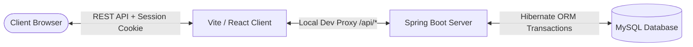

# StreamFlix Subscription Billing & Revenue Management System
## Central Architecture, Core Workflows, and System Manuals Index

Welcome to the **StreamFlix Subscription Billing & Revenue Management System** central reference manual. This system is a state-of-the-art SaaS billing solution built using **React 19 (TypeScript, Vite)** on the frontend and **Spring Boot 3.4.5 (Java 21, Hibernate, MySQL)** on the backend.

To provide the highest level of detail for developers and system administrators, the system documentation has been structured into two dedicated, deep-dive manuals containing file-by-file logic summaries and complete endpoint mappings:

---

### 📂 Directory of Deep-Dive Manuals

#### 1. [Backend Architecture & Technical Manual (BACKEND_DOCUMENTATION.md)](file:///d:/Projects/Infosys%20Project/StreamFlixApp/BACKEND_DOCUMENTATION.md)
*   **Coverage:** 100% of backend files (config, controllers, services, entities, repositories, enums, exception handlers, and custom exceptions).
*   **Key Highlights:** 
    *   Stateful security filters and token handling in [SecurityConfig.java](file:///d:/Projects/Infosys%20Project/StreamFlixApp/backend/src/main/java/com/infy/billing/config/SecurityConfig.java).
    *   Advanced mathematical billing logic and equations for **mid-cycle proration** and **trial period transfers**.
    *   Full Java package overview and database schema mappings.

#### 2. [Frontend Architecture & UI Manual (FRONTEND_DOCUMENTATION.md)](file:///d:/Projects/Infosys%20Project/StreamFlixApp/FRONTEND_DOCUMENTATION.md)
*   **Coverage:** 100% of frontend files (application routes, context providers, layout views, global styles, admin dashboard, user settings, billing pages, checkout steps, and API client interfaces).
*   **Key Highlights:**
    *   Global state orchestration in `AuthContext.tsx` and `CustomerContext.tsx`.
    *   Secure route locks and role-based permissions routing using `RoleGuard.tsx`.
    *   Unified API wrappers for all administrative and customer-facing interactions.

---

### ⚙️ Core System Integration Flow

For questions regarding database initializations or configuration settings, please consult the respective manuals linked above.
