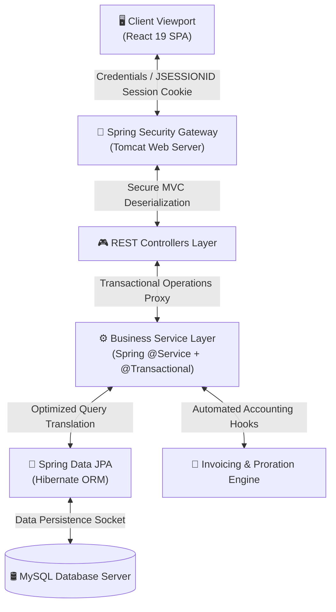
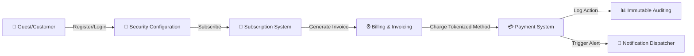
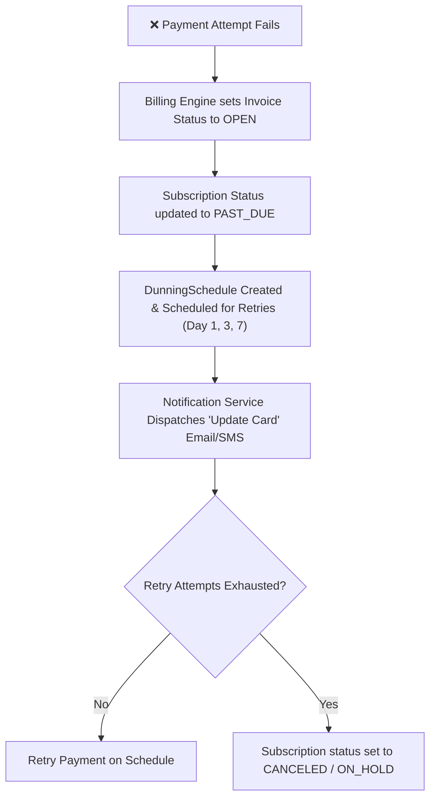
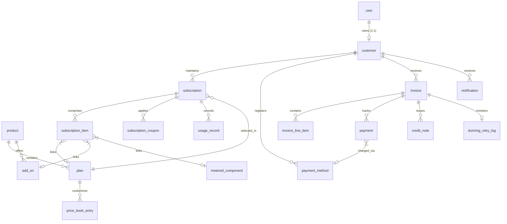

# 🎥 StreamFlix Subscription Billing & Revenue Management Engine

StreamFlix is an enterprise-grade subscription billing and revenue management system designed specifically for high-velocity SaaS and streaming platforms. Built with a robust modular monolith architecture using **Spring Boot 3.4.5 (Java 21)** and a secure, responsive **React 19 (TypeScript + Vite)** client viewport, the system automates and manages the entire subscription lifecycle—from registration and checkout to automated recurring billing, mid-period upgrades with proration, tax handling, coupon application, payment processing, dunning recovery, and revenue reporting.

---

## 📋 Table of Contents
1. [Core Features & Business Capabilities](#-core-features--business-capabilities)
2. [High-Level System Architecture](#%EF%B8%8F-high-level-system-architecture)
3. [Relational Data Persistence (Database Schema)](#-relational-data-persistence-database-schema)
4. [Mathematical Billing & Calculations Framework](#%EF%B8%8F-mathematical-billing--calculations-framework)
5. [End-to-End Core Execution Flows (Code-Paths)](#-end-to-end-core-execution-flows-code-paths)
6. [Comprehensive REST API Reference Manual](#-comprehensive-rest-api-reference-manual)
7. [Frontend Client Architecture](#%EF%B8%8F-frontend-client-architecture)
8. [Quick Start & Developer Setup Guide](#%EF%B8%8F-quick-start--developer-setup-guide)

---

## 💎 Core Features & Business Capabilities

StreamFlix is designed to handle complex monetary calculations and state-driven workflows with perfect reliability:

### 🔄 End-to-End Subscription Lifecycle
*   **State Machine Management:** Governs state transitions across the complete subscription lifecycle: `DRAFT → TRIALING → ACTIVE → PAST_DUE → PAUSED → CANCELED → ON_HOLD`.
*   **Pause & Resume:** Allows customers to pause subscriptions with set resume boundaries, automatically holding billing schedules.
*   **Prorated Mid-Cycle Changes:** Automatically calculates credit refunds and net immediate charges when customers switch plans.
*   **Active Trial Transfers:** Preserves unused trial days when upgrading or modifying plan configurations during a trial.

### ⏰ Automated Billing Engine
*   **Daily Recurring Billing (Cron):** A scheduled task runs automatically to identify subscriptions expiring in the next 24 hours, generates invoices, and attempts payment execution.
*   **Idempotency Protection:** All payment actions and invoice generations use unique idempotency keys to completely eliminate duplicate charges.
*   **Dunning & Revenue Recovery:** Implements an automatic retry schedule (e.g., 1-day, 3-day, 7-day retry intervals) for failed payments. If retries fail, it updates states from `PAST_DUE` to `CANCELED` or `ON_HOLD` and notifies customers.

### 💳 Payments, Coupons, and Taxes
*   **Secure Payment Tokenization:** Keeps payment methods as secure gateway tokens, card illustrations, and metadata in compliance with secure storage standards.
*   **Promotional Coupon Engine:** Supports fixed or percentage discounts, with validation for expiration dates, max redemption counts, and specific plan/addon scopes.
*   **18% GST & Multi-Region Taxes:** Calculates region-based tax rates dynamically, supporting both inclusive and exclusive pricing structures.

### 📊 Invoicing, Auditing, and Revenue Analytics
*   **Automated PDF Invoicing:** Uses structured PDF layout libraries to generate itemized customer receipts, tax invoices, and credit notes.
*   **Immutable Append-Only Audit Logging:** Logs every monetary action (refunds, adjustments, plan changes) with actor, role, IP address, and old/new JSON states.
*   **Financial KPI Reporting:** Captures daily metrics to calculate platform-wide indicators, including MRR (Monthly Recurring Revenue), ARR (Annual Recurring Revenue), ARPU (Average Revenue Per User), Churn Rates (Gross/Net), LTV (Lifetime Value), and DSO (Days Sales Outstanding).

---

## 🏗️ High-Level System Architecture

StreamFlix uses a **Decoupled Client-Server Single Page Application (SPA)** model implemented as a **Modular Monolith**. This combines logical domain separation with simple deployment.



### 1. Architectural Decoupling Principles
*   **Modular Monolith:** All domains (Auth, Catalog, Subscription, Billing, Payments, Analytics, Support) are separated inside the `backend` package structure. They interact through clean service interfaces and database joins while keeping transactional boundaries (`@Transactional`) intact.
*   **Stateful Security Gateway:** Relies on secure, stateful sessions. Spring Security interceptor filters protect REST paths (`/api/**`) using HTTP Session Cookie tracking (`JSESSIONID`), while leaving public registration and plan catalog routes fully open.
*   **Vite Network Proxy:** During local development, the Vite server running on port `3000` proxies API requests to the Spring Boot server running on port `8765`, preventing CORS issues.

### 2. High-Level Data Flow



### 3. Failure Propagation & Dunning



---

## 📊 Relational Data Persistence (Database Schema)

The database schema has **23 relational tables** managed through Spring Data JPA and Hibernate. Timestamps are stored in UTC, and financial amounts are stored in **minor units (paise/cents)** to prevent floating-point precision issues.

### 1. Database Entity-Relationship (ER) Blueprint



### 2. Relational Table Specifications

<details>
<summary>🔑 1. user — Credentials & Roles</summary>

| Column | Data Type | Constraints | Description |
| :--- | :--- | :--- | :--- |
| `user_id` | BIGINT | `PK, AUTO_INCREMENT` | Unique identifier for system logins |
| `full_name` | VARCHAR(100) | `NOT NULL` | User's full name |
| `email` | VARCHAR(120) | `UNIQUE, NOT NULL` | Login credential email |
| `password_hash` | VARCHAR(255) | `NULLABLE` | BCrypt hash (NULL for OAuth2 users) |
| `role` | ENUM | `NOT NULL` | `CUSTOMER`, `SUPPORT`, `FINANCE`, `ADMIN` |
| `status` | ENUM | `NOT NULL` | `ACTIVE`, `INACTIVE`, `SUSPENDED` |
| `created_at` | TIMESTAMP | `DEFAULT CURRENT_TIMESTAMP` | Profile creation time |
| `updated_at` | TIMESTAMP | `ON UPDATE CURRENT_TIMESTAMP` | Last profile update time |

</details>

<details>
<summary>👤 2. customer — Profile & Billing Details</summary>

| Column | Data Type | Constraints | Description |
| :--- | :--- | :--- | :--- |
| `customer_id` | BIGINT | `PK, AUTO_INCREMENT` | Unique customer index |
| `user_id` | BIGINT | `UNIQUE, NOT NULL, FK → user` | 1:1 user account linkage |
| `phone` | VARCHAR(20) | `NULLABLE` | Customer phone number |
| `currency` | CHAR(3) | `NOT NULL` | ISO-4217 code (e.g., `INR`, `USD`) |
| `country` | CHAR(2) | `NOT NULL` | ISO-3166 code (e.g., `IN`, `US`) |
| `state` | VARCHAR(100) | `NULLABLE` | Customer state (used for GST lookup) |
| `city` | VARCHAR(100) | `NULLABLE` | Customer billing city |
| `address_line1`| VARCHAR(255) | `NULLABLE` | Core street details |
| `postal_code` | VARCHAR(20) | `NULLABLE` | Billing ZIP/PIN code |
| `status` | ENUM | `NOT NULL` | `ACTIVE`, `INACTIVE`, `SUSPENDED` |

</details>

<details>
<summary>📦 3. product — Core Software Offerings</summary>

| Column | Data Type | Constraints | Description |
| :--- | :--- | :--- | :--- |
| `product_id` | BIGINT | `PK, AUTO_INCREMENT` | Unique product identifier |
| `name` | VARCHAR(100) | `NOT NULL` | Product name (e.g., "StreamFlix") |
| `description` | TEXT | `NULLABLE` | Product details |
| `status` | ENUM | `NOT NULL` | `ACTIVE`, `INACTIVE` |

</details>

<details>
<summary>🏷️ 4. plan — Subscription Pricing Tiers</summary>

| Column | Data Type | Constraints | Description |
| :--- | :--- | :--- | :--- |
| `plan_id` | BIGINT | `PK, AUTO_INCREMENT` | Unique plan identifier |
| `product_id` | BIGINT | `NOT NULL, FK → product` | Parent product relation |
| `name` | VARCHAR(100) | `NOT NULL` | Tier name (Basic, Premium, etc.) |
| `billing_period`| ENUM | `NOT NULL` | `MONTHLY`, `YEARLY` |
| `default_price_minor`| BIGINT | `NOT NULL` | Fallback price in minor units |
| `default_currency`| CHAR(3) | `NOT NULL` | Default currency ISO code |
| `trial_days` | INT | `DEFAULT 7` | Included trial days |
| `setup_fee_minor`| BIGINT | `DEFAULT 0` | Setup fee in minor units |
| `tax_mode` | ENUM | `NOT NULL` | `INCLUSIVE`, `EXCLUSIVE` |
| `effective_from`| DATE | `NOT NULL` | Plan activation date |
| `effective_to` | DATE | `NULLABLE` | Plan expiration date |
| `status` | ENUM | `NOT NULL` | `ACTIVE`, `INACTIVE` |

</details>

<details>
<summary>🌍 5. price_book_entry — Region-Specific Plan Pricing</summary>

| Column | Data Type | Constraints | Description |
| :--- | :--- | :--- | :--- |
| `price_book_id`| BIGINT | `PK, AUTO_INCREMENT` | Unique record ID |
| `plan_id` | BIGINT | `NOT NULL, FK → plan` | Target plan linkage |
| `region` | VARCHAR(50) | `NOT NULL` | ISO country region (e.g., `IN`, `US`) |
| `currency` | CHAR(3) | `NOT NULL` | Region currency |
| `price_minor` | BIGINT | `NOT NULL` | Price in regional currency minor units |
| `effective_from`| DATE | `NOT NULL` | Price activation date |
| `effective_to` | DATE | `NULLABLE` | Price expiration date |

</details>

<details>
<summary>➕ 6. add_on — Optional Billing Extras</summary>

| Column | Data Type | Constraints | Description |
| :--- | :--- | :--- | :--- |
| `add_on_id` | BIGINT | `PK, AUTO_INCREMENT` | Unique add-on identifier |
| `product_id` | BIGINT | `NOT NULL, FK → product` | Parent product relation |
| `name` | VARCHAR(100) | `NOT NULL` | Add-on name (e.g., "UHD Streaming") |
| `price_minor` | BIGINT | `NOT NULL` | Price in minor units |
| `currency` | CHAR(3) | `NOT NULL` | Currency ISO code |
| `billing_period`| ENUM | `NOT NULL` | `MONTHLY`, `YEARLY` |
| `tax_mode` | ENUM | `NOT NULL` | `INCLUSIVE`, `EXCLUSIVE` |
| `status` | ENUM | `NOT NULL` | `ACTIVE`, `INACTIVE` |

</details>

<details>
<summary>📈 7. metered_component — Usage-Based Billing Components</summary>

| Column | Data Type | Constraints | Description |
| :--- | :--- | :--- | :--- |
| `component_id` | BIGINT | `PK, AUTO_INCREMENT` | Unique component identifier |
| `plan_id` | BIGINT | `NOT NULL, FK → plan` | Associated plan linkage |
| `name` | VARCHAR(100) | `NOT NULL` | Resource name (e.g., "Downloads") |
| `unit_name` | VARCHAR(50) | `NOT NULL` | Metric unit name (e.g., "GB") |
| `price_per_unit_minor`| BIGINT | `NOT NULL` | Unit rate in minor units |
| `free_tier_quantity`| BIGINT | `DEFAULT 0` | Included units before charging |
| `status` | ENUM | `NOT NULL` | `ACTIVE`, `INACTIVE` |

</details>

<details>
<summary>🔄 8. subscription — Active Customer Subscriptions</summary>

| Column | Data Type | Constraints | Description |
| :--- | :--- | :--- | :--- |
| `subscription_id`| BIGINT | `PK, AUTO_INCREMENT` | Unique subscription identifier |
| `customer_id` | BIGINT | `NOT NULL, FK → customer` | Owning customer link |
| `plan_id` | BIGINT | `NOT NULL, FK → plan` | Selected plan link |
| `status` | ENUM | `NOT NULL` | Active state of the subscription |
| `start_date` | DATE | `NOT NULL` | Overall activation date |
| `trial_end_date`| DATE | `NULLABLE` | Trial end date (if trialing) |
| `current_period_start`| DATE | `NOT NULL` | Current billing period start |
| `current_period_end`| DATE | `NOT NULL` | Current billing period end |
| `cancel_at_period_end`| BOOLEAN | `DEFAULT FALSE` | Cancel subscription at period end |
| `canceled_at` | TIMESTAMP | `NULLABLE` | Cancellation timestamp |
| `paused_from` | DATE | `NULLABLE` | Pause schedule start |
| `paused_to` | DATE | `NULLABLE` | Pause schedule end |
| `payment_method_id`| BIGINT | `NOT NULL, FK → payment_method` | Default payment method |
| `currency` | CHAR(3) | `NOT NULL` | Subscription billing currency |

</details>

<details>
<summary>📋 9. subscription_item — Items Included in a Subscription</summary>

| Column | Data Type | Constraints | Description |
| :--- | :--- | :--- | :--- |
| `item_id` | BIGINT | `PK, AUTO_INCREMENT` | Unique line identifier |
| `subscription_id`| BIGINT | `NOT NULL, FK → subscription` | Parent subscription link |
| `item_type` | ENUM | `NOT NULL` | `PLAN`, `ADDON`, `METERED` |
| `plan_id` | BIGINT | `NULLABLE, FK → plan` | Associated plan |
| `addon_id` | BIGINT | `NULLABLE, FK → add_on` | Associated add-on |
| `component_id`| BIGINT | `NULLABLE, FK → metered_component`| Associated metered component |
| `unit_price_minor`| BIGINT | `NOT NULL` | Price in minor units |
| `quantity` | INT | `DEFAULT 1` | Item quantity |
| `tax_mode` | ENUM | `NOT NULL` | `INCLUSIVE`, `EXCLUSIVE` |
| `discount_id` | BIGINT | `NULLABLE, FK → coupon` | Applied coupon relation |

</details>

<details>
<summary>🎟️ 10. subscription_coupon — Applied Coupons</summary>

| Column | Data Type | Constraints | Description |
| :--- | :--- | :--- | :--- |
| `id` | BIGINT | `PK, AUTO_INCREMENT` | Unique reference ID |
| `subscription_id`| BIGINT | `NOT NULL, FK → subscription` | Associated subscription |
| `coupon_id` | BIGINT | `NOT NULL, FK → coupon` | Target coupon linkage |
| `applied_at` | TIMESTAMP | `DEFAULT CURRENT_TIMESTAMP` | Coupon application time |
| `applied_by` | BIGINT | `NULLABLE, FK → user` | Supporting agent user |
| `expires_at` | TIMESTAMP | `NULLABLE` | Coupon expiration time |
| `status` | ENUM | `NOT NULL` | `ACTIVE`, `EXPIRED`, `REVOKED` |

</details>

<details>
<summary>📊 11. usage_record — Metered Resource Usage</summary>

| Column | Data Type | Constraints | Description |
| :--- | :--- | :--- | :--- |
| `usage_id` | BIGINT | `PK, AUTO_INCREMENT` | Unique record ID |
| `subscription_id`| BIGINT | `NOT NULL, FK → subscription` | Target subscription link |
| `component_id`| BIGINT | `NOT NULL, FK → metered_component`| Target component link |
| `quantity` | BIGINT | `NOT NULL` | Logged usage quantity |
| `recorded_at` | TIMESTAMP | `DEFAULT CURRENT_TIMESTAMP` | Recording timestamp |
| `billing_period_start`| DATE | `NOT NULL` | Current billing period start |
| `billing_period_end`| DATE | `NOT NULL` | Current billing period end |
| `idempotency_key`| VARCHAR(100) | `UNIQUE, NOT NULL` | Prevents duplicate usage logging |

</details>

<details>
<summary>🧾 12. invoice — Generated Invoices</summary>

| Column | Data Type | Constraints | Description |
| :--- | :--- | :--- | :--- |
| `invoice_id` | BIGINT | `PK, AUTO_INCREMENT` | Unique invoice index |
| `invoice_number`| VARCHAR(50) | `UNIQUE, NOT NULL` | Invoice reference format |
| `customer_id` | BIGINT | `NOT NULL, FK → customer` | Target customer relation |
| `subscription_id`| BIGINT | `NOT NULL, FK → subscription` | Associated subscription |
| `status` | ENUM | `NOT NULL` | `DRAFT`, `OPEN`, `PAID`, `VOID`, `UNCOLLECTIBLE` |
| `billing_reason`| ENUM | `NOT NULL` | `SUBSCRIPTION_CREATE`, `SUBSCRIPTION_CYCLE`, `SUBSCRIPTION_UPDATE`, `MANUAL` |
| `issue_date` | DATE | `NOT NULL` | Invoice date |
| `due_date` | DATE | `NULLABLE` | Payment due date |
| `subtotal_minor`| BIGINT | `NOT NULL` | Net subtotal in minor units |
| `tax_minor` | BIGINT | `DEFAULT 0` | Total tax in minor units |
| `discount_minor`| BIGINT | `DEFAULT 0` | Total coupon discount in minor units |
| `total_minor` | BIGINT | `NOT NULL` | Total charge in minor units |
| `balance_minor` | BIGINT | `DEFAULT 0` | Unpaid balance in minor units |
| `currency` | CHAR(3) | `NOT NULL` | Currency ISO code |
| `idempotency_key`| VARCHAR(255) | `UNIQUE, NULLABLE` | Prevents duplicate invoice generation |

</details>

<details>
<summary>📝 13. invoice_line_item — Itemized Charges on Invoices</summary>

| Column | Data Type | Constraints | Description |
| :--- | :--- | :--- | :--- |
| `line_item_id` | BIGINT | `PK, AUTO_INCREMENT` | Unique line index |
| `invoice_id` | BIGINT | `NOT NULL, FK → invoice` | Parent invoice relation |
| `description` | VARCHAR(255) | `NOT NULL` | Charge line description |
| `line_type` | ENUM | `NOT NULL` | `PLAN`, `ADDON`, `METERED`, `PRORATION`, `DISCOUNT`, `TAX` |
| `quantity` | INT | `DEFAULT 1` | Charged quantity |
| `unit_price_minor`| BIGINT | `NOT NULL` | Price in minor units |
| `amount_minor` | BIGINT | `NOT NULL` | Total line amount in minor units |
| `tax_rate_id` | BIGINT | `NULLABLE, FK → tax_rate` | Tax rule reference |
| `discount_id` | BIGINT | `NULLABLE, FK → coupon` | Discount coupon reference |
| `period_start` | DATE | `NULLABLE` | Mapped charge start date |
| `period_end` | DATE | `NULLABLE` | Mapped charge end date |
| `metadata` | JSON | `NULLABLE` | Metadata for tracking additions |

</details>

<details>
<summary>💳 14. payment — Transaction Operations</summary>

| Column | Data Type | Constraints | Description |
| :--- | :--- | :--- | :--- |
| `payment_id` | BIGINT | `PK, AUTO_INCREMENT` | Unique transaction ID |
| `invoice_id` | BIGINT | `NOT NULL, FK → invoice` | Target invoice relation |
| `payment_method_id`| BIGINT | `NULLABLE, FK → payment_method`| Payment method link |
| `idempotency_key`| VARCHAR(100) | `UNIQUE, NOT NULL` | Prevents duplicate charges |
| `gateway_ref` | VARCHAR(200) | `NULLABLE` | External reference ID |
| `amount_minor` | BIGINT | `NOT NULL` | Charged amount in minor units |
| `currency` | CHAR(3) | `NOT NULL` | Transaction currency |
| `status` | ENUM | `NOT NULL` | `PENDING`, `SUCCESS`, `FAILED`, `REFUNDED`, `PARTIALLY_REFUNDED` |
| `attempt_no` | INT | `DEFAULT 1` | Number of attempts |
| `response_code` | VARCHAR(50) | `NULLABLE` | Gateway response code |
| `failure_reason`| VARCHAR(255) | `NULLABLE` | Failed charge reason |

</details>

<details>
<summary>💳 15. payment_method — Tokenized Payment Methods</summary>

| Column | Data Type | Constraints | Description |
| :--- | :--- | :--- | :--- |
| `payment_method_id`| BIGINT | `PK, AUTO_INCREMENT` | Unique payment method ID |
| `customer_id` | BIGINT | `NOT NULL, FK → customer` | Target customer link |
| `payment_type` | ENUM | `NOT NULL` | `CARD`, `UPI` |
| `card_last4` | CHAR(4) | `NULLABLE` | Last 4 digits (for cards) |
| `card_brand` | VARCHAR(20) | `NULLABLE` | Card network (e.g., Visa) |
| `gateway_token` | VARCHAR(255) | `NOT NULL` | Secure token reference |
| `upi_id` | VARCHAR(100) | `NULLABLE` | Mapped customer UPI address |
| `is_default` | BOOLEAN | `DEFAULT FALSE` | Default payment method flag |
| `expiry_month` | TINYINT | `NULLABLE` | Card expiration month |
| `expiry_year` | SMALLINT | `NULLABLE` | Card expiration year |
| `status` | ENUM | `NOT NULL` | `ACTIVE`, `EXPIRED`, `REVOKED` |

</details>

<details>
<summary>🏷️ 16. tax_rate — Regional Tax Rules</summary>

| Column | Data Type | Constraints | Description |
| :--- | :--- | :--- | :--- |
| `tax_id` | BIGINT | `PK, AUTO_INCREMENT` | Unique tax rate ID |
| `name` | VARCHAR(100) | `NOT NULL` | Tax name (e.g., "CGST") |
| `region` | VARCHAR(50) | `NOT NULL` | Mapped region (e.g., `IN`, `US`) |
| `rate_percent` | DECIMAL(5,2) | `NOT NULL` | Tax rate percentage |
| `inclusive` | BOOLEAN | `DEFAULT FALSE` | Inclusive vs exclusive tax mode |
| `effective_from`| DATE | `NOT NULL` | Tax activation date |
| `effective_to` | DATE | `NULLABLE` | Tax expiration date |

</details>

<details>
<summary>🎟️ 17. coupon — Discount Configurations</summary>

| Column | Data Type | Constraints | Description |
| :--- | :--- | :--- | :--- |
| `coupon_id` | BIGINT | `PK, AUTO_INCREMENT` | Unique coupon identifier |
| `code` | VARCHAR(50) | `UNIQUE, NOT NULL` | Target coupon code (e.g., `SAVE10`) |
| `name` | VARCHAR(100) | `NULLABLE` | Coupon description |
| `type` | ENUM | `NOT NULL` | `PERCENT`, `FIXED` |
| `amount` | BIGINT | `NOT NULL` | Discount amount (percent or minor units) |
| `currency` | CHAR(3) | `NULLABLE` | Valid currency (for fixed coupons) |
| `duration` | ENUM | `NOT NULL` | `ONCE`, `REPEATING`, `FOREVER` |
| `duration_in_months`| INT | `NULLABLE` | Month duration limits |
| `max_redemptions`| INT | `NULLABLE` | Max redemption limit |
| `redeemed_count`| INT | `DEFAULT 0` | Current redemption count |
| `valid_from` | DATE | `NOT NULL` | Coupon start date |
| `valid_to` | DATE | `NULLABLE` | Coupon end date |
| `status` | ENUM | `NOT NULL` | `ACTIVE`, `EXPIRED`, `DISABLED` |

</details>

<details>
<summary>📝 18. credit_note — Issued Credits & Refunds</summary>

| Column | Data Type | Constraints | Description |
| :--- | :--- | :--- | :--- |
| `credit_note_id`| BIGINT | `PK, AUTO_INCREMENT` | Unique credit note ID |
| `credit_note_number`| VARCHAR(50) | `UNIQUE, NOT NULL` | Credit note reference |
| `invoice_id` | BIGINT | `NOT NULL, FK → invoice` | Mapped invoice linkage |
| `reason` | VARCHAR(255) | `NOT NULL` | Adjustment reason description |
| `amount_minor` | BIGINT | `NOT NULL` | Credit amount in minor units |
| `status` | ENUM | `NOT NULL` | `DRAFT`, `ISSUED`, `APPLIED`, `VOIDED` |
| `created_by` | BIGINT | `NOT NULL, FK → user` | Mapped staff ID |

</details>

<details>
<summary>⚙️ 19. billing_job — Engine Background Logs</summary>

| Column | Data Type | Constraints | Description |
| :--- | :--- | :--- | :--- |
| `job_id` | BIGINT | `PK, AUTO_INCREMENT` | Unique job ID |
| `job_type` | ENUM | `NOT NULL` | `CYCLE_BILLING`, `DUNNING_RETRY`, `REMINDER` |
| `status` | ENUM | `NOT NULL` | `PENDING`, `RUNNING`, `COMPLETED`, `FAILED` |
| `triggered_by` | VARCHAR(100) | `DEFAULT 'SCHEDULER'` | Trigger details |
| `started_at` | TIMESTAMP | `NULLABLE` | Job execution start |
| `completed_at` | TIMESTAMP | `NULLABLE` | Job execution end |
| `total_records` | INT | `DEFAULT 0` | Total records scanned |
| `success_count` | INT | `DEFAULT 0` | Successful updates |
| `failure_count` | INT | `DEFAULT 0` | Failed updates |
| `error_summary` | TEXT | `NULLABLE` | Stacktrace error log summary |

</details>

<details>
<summary>⏳ 20. dunning_retry_log — Failed Payment Retries</summary>

| Column | Data Type | Constraints | Description |
| :--- | :--- | :--- | :--- |
| `retry_id` | BIGINT | `PK, AUTO_INCREMENT` | Unique retry record ID |
| `invoice_id` | BIGINT | `NOT NULL, FK → invoice` | Target invoice |
| `payment_id` | BIGINT | `NULLABLE, FK → payment` | Mapped payment attempt |
| `attempt_no` | INT | `NOT NULL` | Current retry attempt index |
| `scheduled_at` | TIMESTAMP | `NOT NULL` | Scheduled execution time |
| `attempted_at` | TIMESTAMP | `NULLABLE` | Attempt execution time |
| `status` | ENUM | `NOT NULL` | `SCHEDULED`, `ATTEMPTED`, `SUCCESS`, `FAILED` |
| `failure_reason`| VARCHAR(255) | `NULLABLE` | Failed charge details |

</details>

<details>
<summary>📧 21. notification — Sent Notifications</summary>

| Column | Data Type | Constraints | Description |
| :--- | :--- | :--- | :--- |
| `notification_id`| BIGINT | `PK, AUTO_INCREMENT` | Unique notification ID |
| `customer_id` | BIGINT | `NOT NULL, FK → customer` | Target customer linkage |
| `type` | VARCHAR(50) | `NOT NULL` | Notification type (e.g., `RECEIPT`) |
| `subject` | VARCHAR(255) | `NULLABLE` | Mapped subject line |
| `body` | TEXT | `NULLABLE` | Message body details |
| `channel` | ENUM | `NOT NULL` | `EMAIL`, `SMS` |
| `status` | ENUM | `NOT NULL` | `PENDING`, `SENT`, `FAILED`, `SKIPPED` |
| `scheduled_at` | TIMESTAMP | `NULLABLE` | Mapped execution time |
| `sent_at` | TIMESTAMP | `NULLABLE` | Dispatch timestamp |

</details>

<details>
<summary>📜 22. audit_log — Immutable Platform Auditing</summary>

| Column | Data Type | Constraints | Description |
| :--- | :--- | :--- | :--- |
| `audit_id` | BIGINT | `PK, AUTO_INCREMENT` | Unique record ID |
| `actor` | VARCHAR(100) | `NOT NULL` | Acting user ID or process name |
| `actor_role` | VARCHAR(50) | `NULLABLE` | Actor's role details |
| `action` | VARCHAR(100) | `NOT NULL` | Action performed (e.g., `REFUND_ISSUED`) |
| `entity_type` | VARCHAR(50) | `NOT NULL` | Target entity type (e.g., `PAYMENT`) |
| `entity_id` | BIGINT | `NOT NULL` | Target entity ID |
| `old_value` | JSON | `NULLABLE` | Entity state before modification |
| `new_value` | JSON | `NULLABLE` | Entity state after modification |
| `request_id` | VARCHAR(100) | `NULLABLE` | Request correlation ID |
| `ip` | VARCHAR(45) | `NULLABLE` | Origin IP address |

</details>

<details>
<summary>📊 23. revenue_snapshot — Daily Metric Snapshots</summary>

| Column | Data Type | Constraints | Description |
| :--- | :--- | :--- | :--- |
| `snapshot_id` | BIGINT | `PK, AUTO_INCREMENT` | Unique snapshot identifier |
| `snapshot_date` | DATE | `UNIQUE, NOT NULL` | Recording date |
| `mrr_minor` | BIGINT | `NOT NULL` | MRR in minor units |
| `arr_minor` | BIGINT | `NOT NULL` | ARR in minor units |
| `arpu_minor` | BIGINT | `NOT NULL` | ARPU in minor units |
| `active_customers`| INT | `NOT NULL` | Active subscriber count |
| `new_customers` | INT | `DEFAULT 0` | Daily new subscriber count |
| `churned_customers`| INT | `DEFAULT 0` | Daily churned count |
| `gross_churn_percent`| DECIMAL(5,2)| `NOT NULL` | Gross churn percentage |
| `net_churn_percent`| DECIMAL(5,2) | `NOT NULL` | Net churn percentage |
| `ltv_minor` | BIGINT | `DEFAULT 0` | Average LTV in minor units |
| `total_revenue_minor`| BIGINT | `NOT NULL` | Cumulative revenue in minor units |
| `total_refunds_minor`| BIGINT | `DEFAULT 0` | Cumulative refunds in minor units |

</details>

---

## ⚙️ Mathematical Billing & Calculations Framework

StreamFlix handles billing calculations and plan upgrades with high precision to keep customer balances accurate:

### 1. Mid-Cycle Active Proration Calculation
When a customer upgrades or changes plans during an active billing cycle, the system calculates proration based on the unused portion of the current plan:

$$\text{Days Remaining} = \text{Period End Date} - \text{Current Date}$$

$$\text{Old Refund Credit} = \text{Old Invoice Paid Total} \times \frac{\text{Days Remaining}}{\text{Total Period Days}}$$

$$\text{Net Immediate Charge} = \max\left(0, \text{New Plan Total Cost (with Tax)} - \text{Old Refund Credit}\right)$$

On confirmation, the system generates an immediate `PAID` invoice for any positive charge and resets the customer's billing cycle starting from the current date.

---

### 2. Active Trial Period Transfers
If a customer changes plans during a trial period, their trial is updated instead of charging them immediately:

$$\text{Days Used} = \text{Current Date} - \text{Trial Start Date}$$

$$\text{New Trial Days Remaining} = \max\left(0, \text{New Plan Trial Days} - \text{Days Used}\right)$$

The system shifts the future `trialEndDate` based on the remaining trial days, updates the future `OPEN` trial invoice with the new plan details, applies any tax or coupon rules, and adjusts the invoice due date.

---

### 3. Region-Based Tax Rules (e.g., GST)
Taxes are calculated based on the net subtotal after applying coupon discounts:

$$\text{Subtotal} = \text{Plan Base Price} + \text{Add-On Prices} - \text{Coupon Discount}$$

$$\text{Tax Rate (Region-Specific)} = \text{Subtotal} \times 0.18 \quad (\text{e.g., 18\% GST for IN})$$

$$\text{Total Invoice Amount} = \text{Subtotal} + \text{Tax Rate}$$

All operations use minor units (paise/cents) to ensure exact compliance with financial requirements.

---

### 4. Coupon Discounts
The system validates applied coupons and applies the discount to the subtotal:

*   **Percentage-Based Coupons:** Mapped as a percentage deduction.
    $$\text{Discount} = \text{Base Subtotal} \times \left( \frac{\text{Coupon Amount}}{100} \right)$$
*   **Fixed-Amount Coupons:** Deducts a flat rate (e.g., ₹100 or $10).
    $$\text{Discount} = \text{Coupon Amount}$$

> [!NOTE]
> The net subtotal cannot be negative. If the discount exceeds the subtotal, the subtotal is set to `0`.

---

## 🔄 End-to-End Core Execution Flows (Code-Paths)

This section maps step-by-step how data flows through the system during critical operations, starting from customer interactions to database mutations:

### 1. Customer Registration Flow
Tracks how a guest signs up for an account on the frontend and is registered securely in the backend database:

```
[React View: CustomerAuthPage.tsx]
      │ (Fills in Name, Email, Password, clicks Sign Up)
      ▼
[API Client Wrapper: authService.ts]
      │ (Dispatches POST HTTP Request to /api/customer/register)
      ▼
[Security Chain Filter: SecurityConfig.java]
      │ (Matches permitAll() rules, bypasses session checks, forwards request)
      ▼
[MVC DispatcherServlet: AuthController.java]
      │ (Parses payload, validates fields via @Valid on RegisterRequest)
      ▼
[Transactional Service Proxy: AuthServiceImpl.java]
      │ (Checks if email already exists, hashes password using BCrypt with 10 rounds)
      ▼
[Database Persistence: MySQL DB]
        - SQL: INSERT INTO user (email, password_hash, role='CUSTOMER', status='ACTIVE')
        - SQL: INSERT INTO customer (user_id, full_name, currency='INR', status='ACTIVE')
```

---

### 2. Customer Session Login Flow
Tracks how a user authenticates and establishes a secure session:

```
[React View: CustomerAuthPage.tsx]
      │ (Inputs Email/Password, clicks Login)
      ▼
[API Client Wrapper: authService.ts]
      │ (Dispatches POST Request to /api/customer/login)
      ▼
[MVC Controller: AuthController.java]
      │ (Receives LoginRequest payload, delegates to AuthenticationManager)
      ▼
[Core Authentication Engine: DaoAuthenticationProvider]
      │ (Retrieves details, calls passwordEncoder.matches(input, hashedRecord))
      ▼
[Security Context Binder: AuthController.java]
      │ (Saves details to SecurityContextHolder on successful match)
      ▼
[Tomcat Servlet Session Builder]
        - Generates secure session cookie: JSESSIONID=ABCD1234EFGH; HttpOnly; Secure=false
        - Sends cookie in response headers, updating frontend state to authenticated
```

---

### 3. Subscription Onboarding Flow (Multi-Step Checkout)
Tracks how a customer sets up billing parameters and completes a subscription purchase:

```
[React Page Wizard: SubscriptionCheckoutPage.tsx]
      │ (Validates billing, registers card, reviews total, clicks Purchase)
      ▼
[API Client Wrapper: customerService.ts]
      │ (Dispatches CheckoutRequest to POST /api/customer/subscription/checkout)
      ▼
[Transactional Service Layer: SubscriptionFlowServiceImpl.java]
      │ 1. Loads customer profile and validates selected plan
      │ 2. Saves payment details (creates secure default PaymentMethod record)
      │ 3. Sets subscription state to TRIALING (if plan includes trial days) or ACTIVE
      │ 4. Calculates subtotal (Adds Plan and Addons, subtracts Coupons, adds 18% GST)
      │ 5. Generates parent Invoice record and adds itemized InvoiceLineItem rows
      │ 6. If ACTIVE, charges the card and logs transaction in PaymentRepository
      ▼
[Database Persistence: MySQL DB]
        - SQL: INSERT INTO payment_method ...
        - SQL: INSERT INTO subscription ...
        - SQL: INSERT INTO subscription_item ...
        - SQL: INSERT INTO invoice ...
        - SQL: INSERT INTO payment ... (if ACTIVE)
```

---

### 4. Mid-Cycle Prorated Upgrade Flow
Tracks how an active plan is upgraded mid-cycle:

```
[React Plan Grid: SubscriptionPage.tsx]
      │ (Customer selects a new plan tier, reviews proration, confirms upgrade)
      ▼
[API Client Wrapper: customerService.ts]
      │ (Dispatches UpgradeSubscriptionRequest to PUT /api/customer/subscription/upgrade)
      ▼
[Transactional Service Layer: CustomerSubscriptionServiceImpl.java]
      │ 1. Locks the active Customer and Subscription entities
      │ 2. Calculates proration:
      │    - Calculates unused credit on the old plan.
      │    - Calculates total cost of the new plan.
      │    - Net Amount Due = New Plan Cost - Unused Credit.
      │ 3. Instantly updates the subscription's plan mapping
      │ 4. Generates an immediate invoice marked as PAID for the proration fee
      │ 5. Charges the tokenized payment method and logs the transaction
      │ 6. Resets current_period_start to today and current_period_end to today + billing period
      ▼
[Database Persistence: MySQL DB]
        - SQL: UPDATE subscription SET plan_id = newPlanId, current_period_start = ...
        - SQL: INSERT INTO invoice (status = 'PAID', total_minor = prorationFee)
        - SQL: INSERT INTO payment (status = 'SUCCESS')
```

---

## 🔌 Comprehensive REST API Reference Manual

The StreamFlix REST API is mapped to `/api` and is structured logically by domain:

### 👤 1. Authentication & Identity
| Method | Endpoint | Allowed Roles | Description |
| :---: | :--- | :---: | :--- |
| **POST** | `/api/customer/register` | `PUBLIC` | Registers a new customer profile |
| **POST** | `/api/customer/login` | `PUBLIC` | Authenticates customer credentials, returns session |
| **POST** | `/api/manager/login` | `PUBLIC` | Authenticates management credentials |
| **GET** | `/api/auth/me` | `AUTHENTICATED`| Retrieves the current user's profile context |
| **POST**| `/logout` | `AUTHENTICATED`| Invalidates the session and clears cookies |

---

### 💳 2. Customer Profile & Subscriptions
| Method | Endpoint | Allowed Roles | Description |
| :---: | :--- | :---: | :--- |
| **GET** | `/api/customer/profile` | `ROLE_CUSTOMER` | Retrieves the logged-in customer's profile |
| **PUT** | `/api/customer/profile` | `ROLE_CUSTOMER` | Updates contact and address details |
| **GET** | `/api/customer/plans` | `PUBLIC` | Lists all active subscription plans |
| **GET** | `/api/customer/plans/featured` | `PUBLIC` | Lists recommended subscription plans |
| **GET** | `/api/customer/subscription` | `ROLE_CUSTOMER` | Retrieves the active customer subscription details |
| **POST**| `/api/customer/subscription/checkout` | `ROLE_CUSTOMER`| Completes purchase and starts a subscription |
| **PUT** | `/api/customer/subscription/upgrade` | `ROLE_CUSTOMER` | Calculates proration and executes plan upgrade |
| **POST**| `/api/customer/subscription/pause` | `ROLE_CUSTOMER` | Temporarily pauses subscription billing |
| **POST**| `/api/customer/subscription/resume` | `ROLE_CUSTOMER` | Reactivates a paused subscription |
| **POST**| `/api/customer/subscription/cancel` | `ROLE_CUSTOMER` | Cancels subscription billing at current period end |

---

### 🧾 3. Billing, Payments & Support
| Method | Endpoint | Allowed Roles | Description |
| :---: | :--- | :---: | :--- |
| **GET** | `/api/customer/invoices` | `ROLE_CUSTOMER` | Retrieves invoice history for the current user |
| **GET** | `/api/customer/invoices/{id}/pdf` | `ROLE_CUSTOMER` | Downloads the itemized invoice as a PDF |
| **GET** | `/api/customer/payments` | `ROLE_CUSTOMER` | Retrieves payment transaction logs |
| **GET** | `/api/customer/credit-notes` | `ROLE_CUSTOMER` | Lists credit notes issued to the customer |
| **POST**| `/api/customer/coupons/apply` | `ROLE_CUSTOMER` | Applies a discount coupon to active billing |
| **GET** | `/api/customer/coupons/validate`| `ROLE_CUSTOMER` | Validates coupon validity before checkout |
| **GET** | `/api/customer/payment-methods` | `ROLE_CUSTOMER` | Lists registered credit card or UPI profiles |
| **POST**| `/api/customer/payment-methods` | `ROLE_CUSTOMER` | Adds a credit card or UPI profile |
| **PUT** | `/api/customer/payment-methods/{id}/default`| `ROLE_CUSTOMER`| Sets a payment method as the default choice |
| **DELETE**| `/api/customer/payment-methods/{id}`| `ROLE_CUSTOMER` | Removes saved payment method details |
| **GET** | `/api/customer/support/faqs` | `ROLE_CUSTOMER` | Lists platform FAQs |
| **GET** | `/api/customer/support/tickets` | `ROLE_CUSTOMER` | Lists support tickets opened by the customer |
| **POST**| `/api/customer/support/tickets` | `ROLE_CUSTOMER` | Submits a new support ticket request |

---

### 👑 4. Administrative Controls (Admin Panel)
| Method | Endpoint | Allowed Roles | Description |
| :---: | :--- | :---: | :--- |
| **GET** | `/api/admin/metrics` | `ROLE_ADMIN` | Compiles platform-wide MRR, ARR, and active users |
| **GET** | `/api/admin/customers` | `ROLE_ADMIN`, `SUPPORT`| Lists all customer accounts |
| **PUT** | `/api/admin/customers/{id}/toggle-status`| `ROLE_ADMIN`| Suspends or reactivates customer access |
| **POST**| `/api/admin/plans` | `ROLE_ADMIN` | Creates a new plan option |
| **PUT** | `/api/admin/plans/{id}` | `ROLE_ADMIN` | Modifies plan configurations |
| **PUT** | `/api/admin/plans/{id}/toggle-status`| `ROLE_ADMIN`| Toggles a plan between `ACTIVE` and `INACTIVE` |
| **POST**| `/api/admin/addons` | `ROLE_ADMIN` | Creates an add-on option |
| **PUT** | `/api/admin/addons/{id}` | `ROLE_ADMIN` | Modifies add-on configurations |
| **PUT** | `/api/admin/addons/{id}/toggle-status`| `ROLE_ADMIN`| Toggles an add-on between `ACTIVE` and `INACTIVE` |
| **POST**| `/api/admin/coupons` | `ROLE_ADMIN` | Generates a discount coupon code |
| **PUT** | `/api/admin/coupons/{id}` | `ROLE_ADMIN` | Modifies coupon configurations |
| **PUT** | `/api/admin/coupons/{id}/toggle-status`| `ROLE_ADMIN`| Toggles a coupon between `ACTIVE` and `DISABLED` |
| **GET** | `/api/admin/staff` | `ROLE_ADMIN` | Lists all administrative staff accounts |
| **POST**| `/api/admin/staff` | `ROLE_ADMIN` | Registers a new support or finance account |
| **DELETE**| `/api/admin/staff/{id}` | `ROLE_ADMIN` | Deletes administrative staff accounts |

---

### ⚠️ Standard Error Payload
All API failures return a structured JSON response:

```json
{
  "timestamp": "2026-05-07T14:30:00Z",
  "requestId": "req_8765ab",
  "errorCode": "PRORATION_UPGRADE_INVALID",
  "message": "Calculated proration fee resulted in an invalid subtotal negative value.",
  "details": ["Unused refund credit of 49900 paise exceeds the target price of 29900 paise."],
  "path": "/api/customer/subscription/upgrade"
}
```

---

## 🖥️ Frontend Client Architecture

The React frontend uses **Vite** and is structured logically to enforce access control:

```
frontend/src/
├── context/
│   ├── AuthContext.tsx         # Restores sessions (fetchMe), manages login/logout global state
│   └── CustomerContext.tsx     # Stores and refreshes customer profiles and billing defaults
├── routes/
│   └── RoleGuard.tsx           # Route protector (redirects users based on authentication roles)
├── pages/
│   ├── auth/
│   │   └── CustomerAuthPage.tsx # Standard register and login gateway forms
│   ├── customer/
│   │   ├── OverviewPage.tsx    # Displays active subscriptions, trial days, and upcoming charges
│   │   ├── BillingPage.tsx     # Invoice ledger, credit note listings, and PDF downloads
│   │   ├── PaymentMethodsPage.tsx # Secure credit card and UPI management panel
│   │   ├── SubscriptionPage.tsx # Plan selection cards, comparison grids, and upgrades
│   │   ├── SubscriptionCheckoutPage.tsx # Multi-step checkout review wizard
│   │   └── SupportPage.tsx     # FAQ accordions and helpdesk ticketing interface
│   └── admin/
│       └── AdminDashboardPage.tsx # Revenue charts, plan editors, and staff controls
└── services/
    ├── authService.ts          # Authentication requests wrapper (login, register, fetchMe, logout)
    └── customerService.ts      # Billing requests wrapper (getInvoices, addPaymentMethod, upgradePlan)
```

---

## 🛠️ Quick Start & Developer Setup Guide

Follow these steps to set up the Spring Boot server and React frontend in your local development environment:

### Prerequisites
*   **Java Development Kit (JDK):** Version 21
*   **Node.js:** Version 18 or higher (with npm)
*   **Build Tool:** Maven 3.8+
*   **Database Server:** MySQL 8.0+

---

### Step 1: Initialize the MySQL Database
1.  Open your MySQL terminal or database client and run:
    ```sql
    CREATE DATABASE subscription_billing;
    ```
2.  Import the pre-configured schema and seed data from the resources directory:
    ```bash
    mysql -u root -p subscription_billing < backend/src/main/resources/schema.sql
    ```

---

### Step 2: Configure System Properties
Open [application.properties](file:///D:/Projects/Infosys%20Project/StreamFlixApp/backend/src/main/resources/application.properties) and update your database connection credentials if they differ from the defaults:

```properties
spring.datasource.url=jdbc:mysql://localhost:3306/subscription_billing
spring.datasource.username=root
spring.datasource.password=your_mysql_password
```

---

### Step 3: Run the Backend Application
1.  Navigate to the backend directory:
    ```bash
    cd backend
    ```
2.  Clean, compile, and run the Spring Boot server using Maven:
    ```bash
    mvn clean install
    mvn spring-boot:run
    ```
3.  The backend server will start on port **`8765`**.

---

### Step 4: Run the Frontend Application
1.  Open a new terminal window and navigate to the frontend directory:
    ```bash
    cd frontend
    ```
2.  Install the required dependencies:
    ```bash
    npm install
    ```
3.  Start the Vite local development server:
    ```bash
    npm run dev
    ```
4.  The frontend client will open on **`http://localhost:3000`**.

---

### 🔐 Pre-Seeded Portals Staff Logins
You can log in immediately to review the different portals using these seeded accounts:

| Portal Role | Email Username | Default Password | Access Level |
| :---: | :--- | :--- | :--- |
| **System Admin** | `admin@streamflix.com` | `Password123!` | Management panels, metrics, catalog updates |
| **Finance Lead** | `finance@streamflix.com` | `Password123!` | Revenue analytics, invoices, credit logs |
| **Support Lead**| `support@streamflix.com` | `Password123!` | Ticketing review, FAQs, customer accounts |

---

### 🧪 Run Automated Tests
To run backend unit and integration tests (JUnit 5 + Mockito) and verify system integrity, run:
```bash
cd backend
mvn test
```

---
<p align="center">
  <strong>StreamFlix Subscription Billing & Revenue Monolith</strong><br>
  Designed for Perfect Computational Precision and Secure Subscription Lifecycles
</p>
