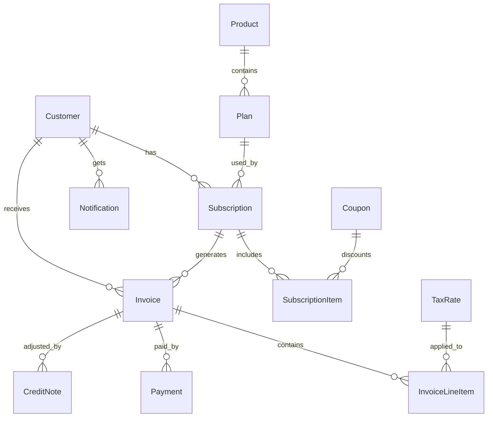
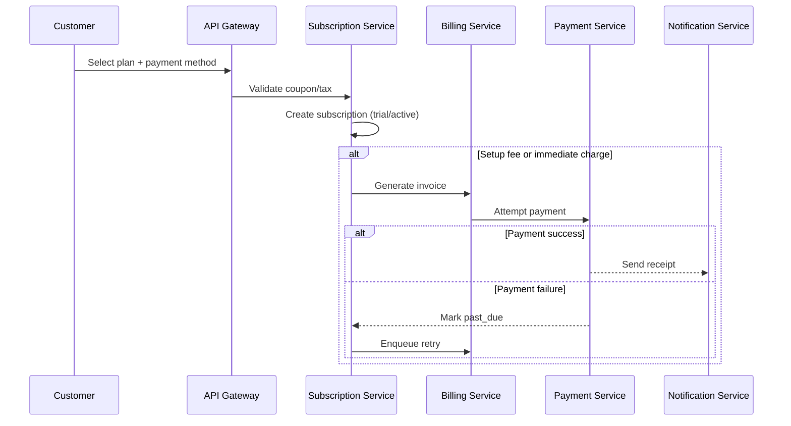

# StreamFlix — Subscription Billing & Revenue Management System

> A full-stack Subscription Billing & Revenue Management System that automates recurring billing for SaaS/streaming-style products. Supports subscription lifecycle management, automated billing cycles, taxes & discounts, proration, invoicing, credit notes, refunds, dunning with retries, renewal reminders, and revenue analytics (MRR, ARR, Churn).

---

## Table of Contents

1. [Project Description](#1-project-description)
2. [Scope](#2-scope)
3. [Actors & Roles](#3-actors--roles)
4. [Assumptions & Dependencies](#4-assumptions--dependencies)
5. [User Stories](#5-user-stories)
6. [Functional Requirements](#6-functional-requirements)
7. [Non-Functional Requirements](#7-non-functional-requirements)
8. [Data Model (ER Overview)](#8-data-model-er-overview)
9. [API Design (High-Level)](#9-api-design-high-level)
10. [Workflows & Sequence Flows](#10-workflows--sequence-flows)
11. [Frontend Components](#11-frontend-components)
12. [Security & Compliance](#12-security--compliance)
13. [Environment Requirements](#13-environment-requirements)
14. [Validation & Error Handling](#14-validation--error-handling)
15. [Testing Strategy](#15-testing-strategy)
16. [Logging, Monitoring & Observability](#16-logging-monitoring--observability)
17. [DevOps & Deployment](#17-devops--deployment)
18. [KPIs & Analytics](#18-kpis--analytics)
19. [Final Deliverables](#19-final-deliverables)

---

## 1. Project Description

A **Subscription Billing & Revenue Management System** that automates recurring billing for SaaS/streaming-style products. It supports:

- Subscription creation & lifecycle management
- Automatic billing cycles
- Taxes & discounts
- Proration for mid-cycle changes
- Invoices, credit notes & receipts
- Refunds & adjustments
- Dunning with configurable retry strategies
- Renewal reminders & notifications
- Revenue analytics dashboard (MRR, ARR, Churn)

---

## 2. Scope

### In Scope

| Area | Details |
|---|---|
| **Catalog** | Product & Plan catalog (tiers, add-ons, metered components) |
| **Subscriptions** | Subscription lifecycle (trial → active → paused → canceled) |
| **Billing Engine** | Cycle runs, proration, mid-cycle changes |
| **Invoicing** | Invoices, credit notes, and receipts |
| **Payments** | Mock Payment Service — simulated payments |
| **Taxes & Discounts** | GST/VAT, coupons, discount codes |
| **Dunning** | Retry strategies, reminders & notifications |
| **Analytics** | Revenue analytics dashboard (MRR/ARR, churn, retention) |
| **Portals** | Role-based portals: Admin, Finance, Support, Customer |

---

## 3. Actors & Roles

| Actor | Responsibilities |
|---|---|
| **Customer** | Subscribes to plans, manages payment methods, views invoices |
| **Admin** | Manages products, plans, price books, coupons, tax rules |
| **Finance Manager** | Handles invoices, collections, revenue reports |
| **Support Agent** | Assists customers, processes refunds/adjustments |
| **System (Billing Engine)** | Scheduled billing, retries, automated notifications |
| **Payment Gateway (External)** | Processes payments (sandbox/mock) |

---

## 4. Assumptions & Dependencies

- Payment gateway adapter is **mocked** (simulated sandbox)
- Internal time stored in **UTC**; user display is timezone-aware
- Email/SMS providers configured as **mock** services
- Architecture: **Microservices** over REST + async events
- Currency follows **ISO-4217**; amounts stored in **minor units** (e.g., paise for INR)
- Tax calculation supports both **inclusive** and **exclusive** modes

---

## 5. User Stories

### US-01 — Subscribe to a Plan *(Must Have)*

> **As a customer**, I want to subscribe to a plan (with optional add-ons) so that I can start using the service.

**Acceptance Criteria:**
- Choose plan, billing cycle, add-ons
- Enter payment method
- Trial start/end dates shown when applicable
- Subscription becomes `active` on success; `past_due` on failure

---

### US-02 — Automated Billing Cycles *(Must Have)*

> **As a system**, I want to run automated billing cycles so that subscriptions are renewed on time.

**Acceptance Criteria:**
- Cron detects subscriptions due in next 24h
- Generate invoice → attempt charge → update status
- On success: send receipt; on failure: mark `past_due` and enqueue retry
- Idempotency key prevents duplicate charges

---

### US-03 — Catalog Management *(Must Have)*

> **As an admin**, I want to configure products, plans, and pricing to offer flexible subscriptions.

**Acceptance Criteria:**
- CRUD for product, plan, add-on, metered component
- Define price, billing period, trial duration, setup fee
- Price books per currency; effective start/end dates

---

### US-04 — Taxes & Discounts *(Must Have)*

> **As a finance manager**, I want taxes and discounts applied correctly for compliance and transparency.

**Acceptance Criteria:**
- Tax rules by region (GST/VAT), inclusive/exclusive
- Coupons: amount/percentage, one-time/recurring, expiry, usage limits
- Invoices show line-item taxes and discounts

---

### US-05 — Renewal Reminders *(Must Have)*

> **As a customer**, I want renewal reminders so that I'm informed before charges.

**Acceptance Criteria:**
- Reminder at T-7 and T-1 days (configurable)
- Email/SMS with amount, date, and manage link (Mock)
- Notification logs maintained

---

### US-06 — Upgrades & Downgrades with Proration *(Must Have)*

> **As a customer**, I want upgrades/downgrades mid-cycle with proration, so charges are fair.

**Acceptance Criteria:**
- Proration based on remaining days/usage
- Charge immediately or defer to next renewal
- Proration lines appear on invoice

---

### US-07 — Revenue Analytics *(Must Have)*

> **As a finance manager**, I want revenue analytics so that I can track MRR/ARR and churn.

**Acceptance Criteria:**
- KPIs: MRR, ARR, ARPU, Net & Gross Churn, LTV
- Filters by time range, plan, region
- Export CSV/PDF

---

### US-08 — Refunds & Credit Notes *(Must Have)*

> **As a support agent**, I want to issue refunds/credit notes so that customer disputes are handled.

**Acceptance Criteria:**
- Full/partial refund with reason
- Auto-create credit note; update reports
- Audit log captured

---

### US-09 — Dunning & Retry Strategies *(Must Have)*

> **As an admin**, I want dunning & retry strategies so failed payments recover automatically.

**Acceptance Criteria:**
- Retry schedule (e.g., after 1d, 3d, 7d)
- Card update reminder sent to customer
- After max retries: cancel or hold (configurable policy)

---

## 6. Functional Requirements

### 6.1 Catalog

- Manage products, plans, add-ons, metered units
- Price books per currency; effective date ranges
- Plan attributes: billing interval, trial days, setup fee, tax behavior, proration behavior

### 6.2 Subscription Management

- Lifecycle: `draft` → `trialing` → `active` → `past_due` → `paused` → `canceled`
- Mid-cycle changes with proration; pause/resume rules
- Multiple subscriptions per customer

### 6.3 Billing & Invoicing

- Cycle detection via scheduler and on-demand trigger
- Invoice generation: header, line items, taxes, discounts, totals
- Payment attempt & status update; credit notes for refunds

### 6.4 Taxes & Discounts

- Region-based tax rules; inclusive/exclusive support
- Coupons: percent/fixed; duration — once/repeating/forever
- Rounding policy and minor-unit storage

### 6.5 Payments

- Payment tokenization; idempotent charge endpoint
- No raw PAN storage; webhook simulation for results

### 6.6 Dunning & Retries

- Configurable retry schedule and max attempts
- Customer notifications; status transitions on completion

### 6.7 Notifications

- Templates for reminders, receipts, failures, upcoming invoice
- Email (SMTP) and SMS provider support; unsubscribe preferences (Mock)

### 6.8 Reporting & Analytics

- KPIs: MRR, ARR, ARPU, Churn, LTV, DSO
- Daily snapshots; CSV/PDF exports

### 6.9 Administration & Compliance

- RBAC roles; audit logs
- PII retention and masking rules

---

## 7. Non-Functional Requirements

| Category | Requirement |
|---|---|
| **Performance** | Low-latency API responses; billing engine handles bulk cycles efficiently |
| **Scalability** | Horizontally scalable microservices |
| **Security** | OAuth2, Spring Security, RBAC |
| **Reliability** | 99.5% uptime; idempotency; retries with exponential backoff |
| **Maintainability** | Clean architecture; DTO mapping; test coverage ≥ 80% |
| **Observability** | Structured logs, metrics, traces, dashboards |

---

## 8. Data Model (ER Overview)

### Core Entities

```
Customer (id, name, email, phone, currency, address, status, created_at, updated_at)

Product (id, name, description, status, created_at, updated_at)

Plan (id, product_id, name, billing_period, price_minor, currency, trial_days,
      setup_fee_minor, tax_mode, effective_from, effective_to, status)

Subscription (id, customer_id, plan_id, status, start_date, current_period_start,
              current_period_end, cancel_at_period_end, paused_from, paused_to,
              payment_method_id, currency)

SubscriptionItem (id, subscription_id, item_type, unit_price_minor, quantity,
                  tax_mode, discount_id)

Invoice (id, customer_id, subscription_id, status, issue_date, due_date,
         subtotal_minor, tax_minor, discount_minor, total_minor, balance_minor, currency)

InvoiceLineItem (id, invoice_id, description, quantity, unit_price_minor,
                 amount_minor, tax_rate_id, discount_id, metadata)

Payment (id, invoice_id, gateway_ref, amount_minor, currency, status,
         attempt_no, response_code, created_at)

TaxRate (id, region, rate_percent, inclusive, effective_from, effective_to)

Coupon (id, code, type, amount, duration, duration_in_months, max_redemptions,
        redeemed_count, valid_from, valid_to, status)

CreditNote (id, invoice_id, reason, amount_minor, created_by, created_at)

AuditLog (id, actor, action, entity_type, entity_id, old_value, new_value,
          request_id, ip, created_at)

Notification (id, customer_id, type, subject, channel, status, sent_at)
```

### ER Diagram (Simplified)



---

## 9. API Design (High-Level)

**Base URI:** `/api/v1`

### Auth

| Method | Endpoint | Description |
|---|---|---|
| `POST` | `/auth/login` | User login |
| `POST` | `/auth/refresh` | Refresh access token |

### Customers

| Method | Endpoint | Description |
|---|---|---|
| `POST` | `/customers` | Create customer |
| `GET` | `/customers/{id}` | Get customer by ID |
| `GET` | `/customers?email=&status=` | Search customers |
| `PUT` | `/customers/{id}` | Update customer |
| `DELETE` | `/customers/{id}` | Delete customer |

### Catalog

| Method | Endpoint | Description |
|---|---|---|
| `POST` | `/products` | Create product |
| `GET` | `/products` | List products |
| `POST` | `/plans` | Create plan |
| `GET` | `/plans?productId=&currency=` | List plans (filtered) |
| `POST` | `/addons` | Create add-on |
| `GET` | `/addons` | List add-ons |

### Subscriptions

| Method | Endpoint | Description |
|---|---|---|
| `POST` | `/subscriptions` | Create subscription |
| `GET` | `/subscriptions/{id}` | Get subscription |
| `PATCH` | `/subscriptions/{id}` | Update subscription (upgrade/downgrade) |
| `POST` | `/subscriptions/{id}/cancel?at_period_end=true/false` | Cancel subscription |
| `GET` | `/customers/{id}/subscriptions` | List customer subscriptions |

### Invoices

| Method | Endpoint | Description |
|---|---|---|
| `GET` | `/invoices?customerId=&status=` | List invoices (filtered) |
| `GET` | `/invoices/{id}` | Get invoice by ID |
| `POST` | `/invoices/{id}/finalize` | Finalize draft invoice |
| `POST` | `/invoices/{id}/void` | Void invoice |
| `POST` | `/invoices/{id}/pay` | Pay invoice |

### Payments

| Method | Endpoint | Description |
|---|---|---|
| `POST` | `/payments` | Create payment |
| `GET` | `/payments/{id}` | Get payment details |
| `POST` | `/payments/{id}/refund` | Issue refund |

### Taxes & Coupons

| Method | Endpoint | Description |
|---|---|---|
| `POST` | `/tax-rates` | Create tax rate |
| `GET` | `/tax-rates` | List tax rates |
| `POST` | `/coupons` | Create coupon |
| `GET` | `/coupons` | List coupons |
| `POST` | `/coupons/validate` | Validate coupon code |

### Billing Engine

| Method | Endpoint | Description |
|---|---|---|
| `POST` | `/billing/run` | Trigger billing run |
| `GET` | `/billing/jobs?status=` | List billing jobs |

### Reports

| Method | Endpoint | Description |
|---|---|---|
| `GET` | `/reports/revenue?from=&to=&granularity=` | Revenue report |
| `GET` | `/reports/mrr?from=&to=` | MRR report |
| `GET` | `/reports/churn?from=&to=` | Churn report |

### HTTP Status Codes

`200` · `201` · `202` · `400` · `401` · `403` · `404` · `409` · `422` · `429` · `500`

---

## 10. Workflows & Sequence Flows

### 10.1 Subscription Creation



### 10.2 Renewal Billing (Cron)

1. Find subscriptions expiring in next 24 hours
2. Generate invoice with proration/discounts/taxes
3. Attempt payment (idempotent) and update status
4. Send receipt or failure notice

### 10.3 Upgrade/Downgrade Mid-Cycle

1. Compute proration credit/debit
2. Charge now or defer to next renewal
3. Update subscription items
4. Create audit log entry

### 10.4 Dunning & Retry

1. On failure: mark `past_due` and schedule retries
2. Notify customer to update payment method
3. After max attempts: cancel or place on hold per policy

---

## 11. Frontend Components

### Customer Portal

- Subscription onboarding wizard
- Manage plan (upgrade / downgrade / pause / cancel)
- Invoices & payments with PDF downloads
- Payment methods management
- Notifications & preferences

### Admin Console

- Product / Plan management
- Price books, tax rules, coupons
- Billing jobs dashboard

### Finance Dashboard

- Invoice aging, collections, refunds
- Revenue analytics (MRR/ARR, Churn, ARPU)
- Export center (CSV/PDF)

### Support Console

- Customer lookup
- Subscription history & actions
- Refund / credit note workflows
- Notes & communication log

---

## 12. Security & Compliance

| Area | Details |
|---|---|
| **Authentication** | OAuth2 / Spring Security |
| **Authorization** | RBAC — Admin, Finance, Support, Customer |
| **Payment Data** | Tokenization for sensitive data; no raw PAN storage |
| **Encryption** | PII encrypted at rest; TLS in transit |
| **Web Security** | CSRF and CORS configuration |
| **Audit** | Immutable audit logs for all monetary actions |

---

## 13. Environment Requirements

### Technology Stack

| Layer | Technology |
|---|---|
| **Backend** | Spring Boot, Spring Data JPA, Spring REST, Spring Cloud Consul |
| **Scheduler** | Spring `@Scheduled` |
| **Frontend** | React, TypeScript, HTML5, CSS3, Bootstrap |
| **Database** | MySQL |
| **Security** | OAuth2 / Spring Security |
| **API Docs** | Swagger / OpenAPI |
| **Config** | Spring Cloud Config |

### Microservices Architecture

```
api-gateway
auth-service
catalog-service
customer-service
subscription-service
billing-service
payment-service
invoice-service
notification-service
reporting-service
```

### Resilience

- Circuit Breaker: timeout **3s**, error threshold **50%**, open after **10** consecutive failures, open state **60s**, with fallbacks
- **Two instances** per microservice with load balancing

---

## 14. Validation & Error Handling

- **Bean Validation** for all inputs; custom validators for complex rules
- Standard error response format:

```json
{
  "timestamp": "2026-05-11T15:49:00Z",
  "requestId": "req-abc-123",
  "errorCode": "PAYMENT_RETRY_EXCEEDED",
  "message": "Maximum retry attempts exceeded",
  "details": ["Attempt 3 of 3 failed"],
  "path": "/api/v1/payments"
}
```

- Centralized exception handling via `@ControllerAdvice`
- Custom exceptions: `PaymentRetryExceededException`, `ProrationCalculationException`, etc.

---

## 15. Testing Strategy

| Type | Tools | Target |
|---|---|---|
| **Unit** | JUnit + Mockito | ≥ 80% coverage |
| **Integration** | Spring Boot Test | Repository & controller tests |
| **Scheduler** | Simulated clock | Billing run timing verification |
| **Security** | Spring Security Test | RBAC enforcement |
| **API** | Postman / Swagger | Endpoint verification |

---

## 16. Logging, Monitoring & Observability

- **Structured JSON logs** with `correlationId` and `requestId`
- `LoggingAspect` for service-layer exception capture
- **Metrics:** latency, error rates, retries, success ratios
- **Health checks** via `/actuator` endpoints; job status dashboards
- **Alerts** on billing failures and dunning success thresholds

---

## 17. DevOps & Deployment

- **Build:** Maven CI with unit tests + SonarQube
- **Config:** Externalized (Spring Cloud Config)
- **Environment:** Dev

---

## 18. KPIs & Analytics

### Financial

| KPI | Description |
|---|---|
| MRR | Monthly Recurring Revenue |
| ARR | Annual Recurring Revenue |
| ARPU | Average Revenue Per User |
| LTV | Customer Lifetime Value (basic) |
| Gross/Net Churn | Revenue lost from cancellations |
| DSO | Days Sales Outstanding |

### Operational

- Invoice success rate
- Retry recovery rate
- Payment latency
- Refund ratio

### Customer

- Churn reasons analysis
- Plan distribution
- Activation rate

### Engineering

- Error budget burn
- SLOs for key APIs

---

## 19. Final Deliverables

- [ ] Application archives (`.jar`) with complete source code
- [ ] Database DDL Scripts (MySQL)
- [ ] OpenAPI / Swagger documentation
- [ ] Sample screenshots (Customer Portal, Finance Dashboard, Admin Console)
- [ ] Postman collection for REST endpoints
- [ ] Test coverage report (≥ 80%)
- [ ] SonarQube report meeting Quality Gate (Security A, Reliability A, Issues ≤ 5, Coverage ≥ 80%, Duplication ≤ 3%, Security Hotspots A)

---

## License

*Internal project — Infosys*
