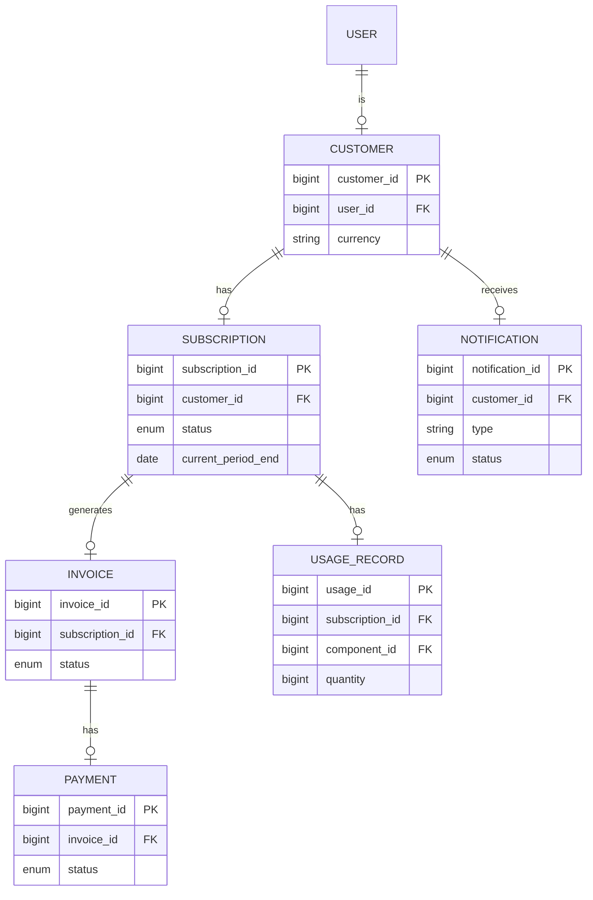
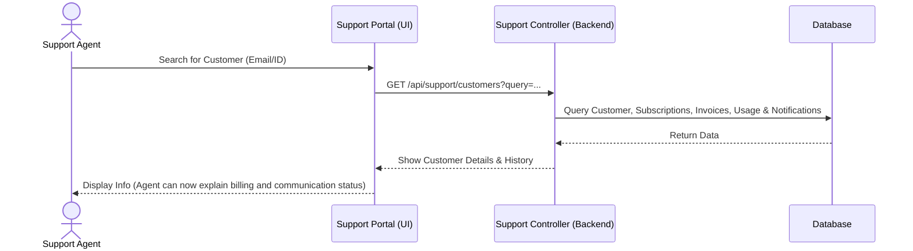

# Support Agent Module Specification

This document outlines the requirements, functionalities, and database mappings for the **Support Agent** module in the StreamFlix Subscription Billing & Revenue Management System, aligned with the current business rules (no refunds, cancellation at period end only).

## 1. Role & Overview

The **Support Agent** is responsible for assisting customers with account inquiries, billing questions, and subscription management.

**Key Constraint**: In accordance with the current business logic, **refunds (full or partial) are not supported**, and subscription **cancellation is only allowed at the end of the billing period**. Therefore, the Support Agent's role is focused on information retrieval and customer support rather than financial adjustments.

In the database schema, the `user` table supports the `'SUPPORT'` role in the `role` enum. This role will have access to a dedicated **Support Console** in the frontend.

## 2. Key Functionalities

The Support Agent module will provide the following capabilities:

### A. Customer Lookup & View
- **Search**: Search for customers by Name, Email, or Customer ID.
- **Profile View**: View customer details including contact info, currency, and country.
- **Subscription History**: View active and past subscriptions, including their current period end dates.
- **Billing History**: View invoices and payment history to explain charges to customers.

### B. Subscription Status Inquiry
- Verify when a customer's subscription is set to renew or expire.
- Confirm if a cancellation request has been set for the period end.

### C. Billing & Usage Transparency
- **View Metered Usage**: Access the `usage_record` table to explain exactly why a customer was charged a certain amount if they use metered components.
- **View Notification History**: Access the `notification` table to check if the customer was actually sent renewal reminders or payment failure alerts. This helps resolve disputes like "I didn't know I was going to be charged."

### D. Audit Logging
- Read-only access to specific logs or simply logging the fact that an agent viewed a customer's sensitive data (if required for compliance).

---

## 3. Database Tables & Mapping

The Support Agent module interacts with several tables. Since the agent has **read-only** access for support purposes, the mapping is as follows:

### Relevant Tables

| Table Name | Access Level | Description | Mapping / Relationships |
| :--- | :--- | :--- | :--- |
| **`user`** | Read | To identify the support agent and authenticate. | `user.role` = 'SUPPORT' |
| **`customer`** | Read | To lookup customer details and history. | `customer.user_id` -> `user.user_id` |
| **`subscription`** | Read | To view subscription status, plans, and period end dates. | `subscription.customer_id` -> `customer.customer_id` |
| **`invoice`** | Read | To view billing details and explain charges. | `invoice.subscription_id` -> `subscription.subscription_id` |
| **`payment`** | Read | To view payment history and verify successful charges. | `payment.invoice_id` -> `invoice.invoice_id` |
| **`usage_record`** | Read | To explain metered charges to customers. | `usage_record.subscription_id` -> `subscription.subscription_id` |
| **`notification`** | Read | To check communication history (reminders, alerts). | `notification.customer_id` -> `customer.customer_id` |
| **`audit_log`** | Read / Create | To view history or log that a support agent accessed records. | `audit_log.actor` = Support Agent Name |

### Entity Relationship Mapping (Read-Only Context)

---

## 4. Proposed Support Workflow (Customer Inquiry)

Here is the sequence of events when a Support Agent assists a customer:

## 5. Next Steps for Implementation

To build this module, we need to:
1.  **Backend**:
    - Create `SupportController.java` with endpoints for customer lookup (read-only, including usage and notifications).
2.  **Frontend**:
    - Create a new route `/support` with a layout consistent with the Admin and Customer dashboards.
    - Build the Customer Lookup view and detail display (including tabs for Usage and Notifications).
