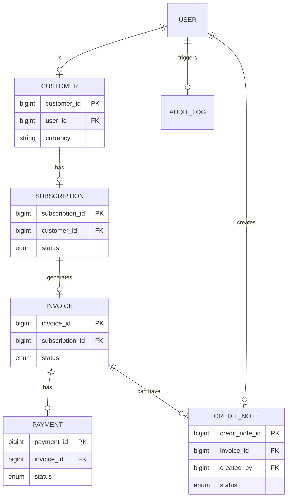
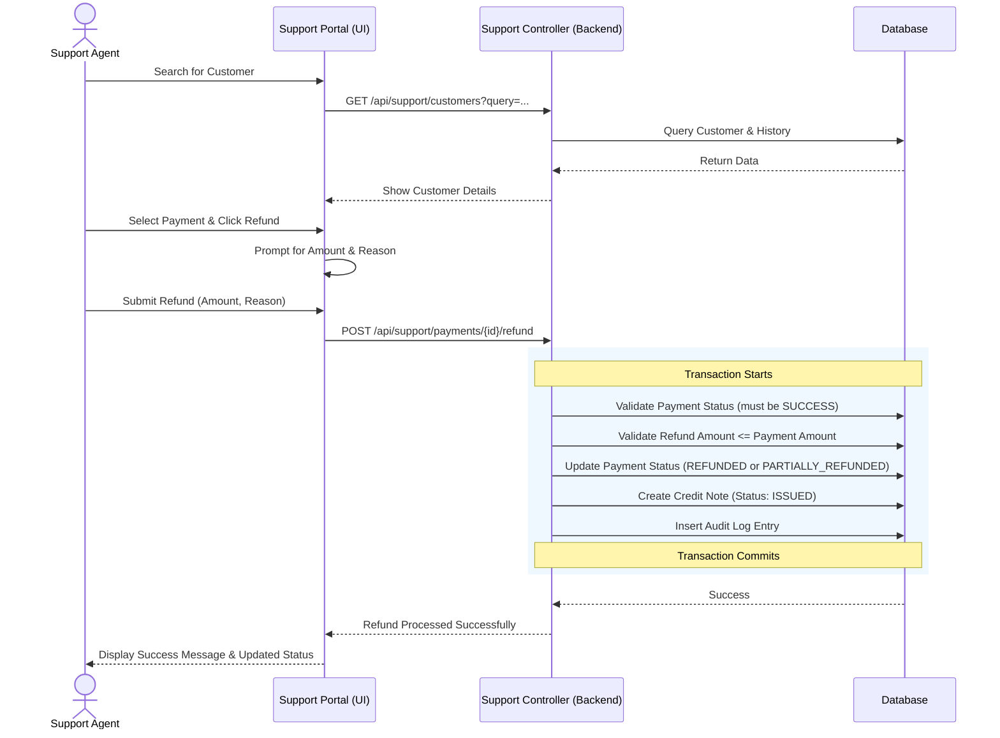

# Support Agent Module Specification

This document outlines the requirements, functionalities, and database mappings for the **Support Agent** module in the StreamFlix Subscription Billing & Revenue Management System.

## 1. Role & Overview

The **Support Agent** plays a critical role in customer retention and dispute resolution. They are responsible for assisting customers with billing issues, processing refunds, and managing account adjustments.

In the database schema, the `user` table supports the `'SUPPORT'` role in the `role` enum. This role will have access to a dedicated **Support Console** (to be built) in the frontend.

## 2. Key Functionalities

The Support Agent module will provide the following capabilities:

### A. Customer Lookup & View
- **Search**: Search for customers by Name, Email, or Customer ID.
- **Profile View**: View customer details including contact info, currency, and country.
- **Subscription History**: View active and past subscriptions.
- **Billing History**: View invoices, payments, and credit notes associated with the customer.

### B. Refund Processing (US-08)
- **Full Refund**: Process a full refund for a successful payment.
- **Partial Refund**: Process a partial refund with a specified amount (cannot exceed the original payment amount).
- **Reason Tracking**: Capture the reason for the refund (e.g., "Accidental purchase", "Service issue").
- **Status Update**: Update the payment status to `REFUNDED` or `PARTIALLY_REFUNDED`.

### C. Credit Note Management
- **Generation**: Automatically generate a credit note when a refund is processed.
- **Linkage**: The credit note must be linked to the original invoice.
- **Status**: Credit notes are created with status `ISSUED`.

### D. Audit Logging
- Every action performed by a Support Agent (especially refunds and adjustments) must be logged in the `audit_log` table for compliance and security.

---

## 3. Database Tables & Mapping

The Support Agent module interacts with several tables. Below is the mapping and access level required:

### Relevant Tables

| Table Name | Access Level | Description | Mapping / Relationships |
| :--- | :--- | :--- | :--- |
| **`user`** | Read | To identify the support agent and authenticate. | `user.role` = 'SUPPORT' |
| **`customer`** | Read | To lookup customer details and history. | `customer.user_id` -> `user.user_id` |
| **`subscription`** | Read | To view subscription status and plans. | `subscription.customer_id` -> `customer.customer_id` |
| **`invoice`** | Read | To view billing details and link credit notes. | `invoice.subscription_id` -> `subscription.subscription_id` |
| **`payment`** | Read / Update | To view payment history and process refunds. | `payment.invoice_id` -> `invoice.invoice_id`   Update `status` to 'REFUNDED' or 'PARTIALLY_REFUNDED' |
| **`credit_note`** | Create / Read | To issue credit notes for refunds. | `credit_note.invoice_id` -> `invoice.invoice_id`   `credit_note.created_by` -> `user.user_id` (Support Agent) |
| **`audit_log`** | Create | To log support actions. | `audit_log.actor` = Support Agent Name   `audit_log.actor_role` = 'SUPPORT' |

### Entity Relationship & Flow Mapping

---

## 4. Proposed Refund Workflow

Here is the sequence of events when a Support Agent processes a refund:

## 5. Next Steps for Implementation

To build this module, we need to:
1.  **Backend**:
    - Create `SupportController.java` with endpoints for customer lookup and refund processing.
    - Implement the refund logic in a service (e.g., `SupportService` or `FinanceService`).
    - Ensure audit logging is triggered.
2.  **Frontend**:
    - Create a new route `/support` with a layout consistent with the Admin and Customer dashboards.
    - Build the Customer Lookup view.
    - Build the Refund modal/form.
